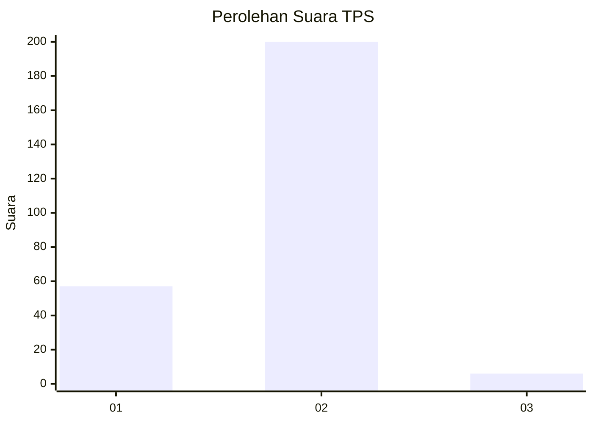
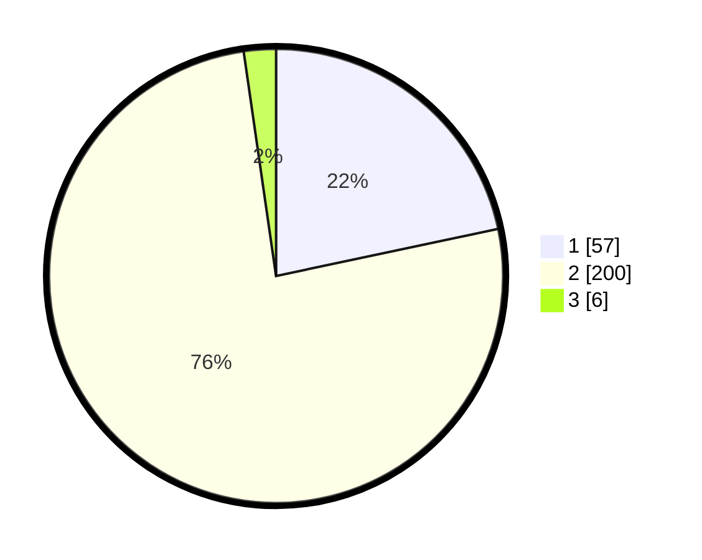

# Hasil

## Grafik

## Tabel

| No. | Nama Paslon    | Suara | Suara (raw) | Persentase |
|:--- |:-------------- | -----:| -----------:| ----------:|
| 1   | ANIES MUHAIMIN | 57    | [57][p-1]   | 21,67      |
| 2   | PRABOWO GIBRAN | 200   | [200][p-2]  | 76,05      |
| 3   | GANJAR MAHFUD  | 6     | [6][p-3]    | 2,28       |

[p-1]: https://github.com/gigit-pemilu/pemilu-2024-75-gorontalo/blob/main/pilpres/hitung-suara/sub/75-gorontalo/sub/04-pohuwato/sub/06-patilanggio/sub/2005-dulomo/sub/001-tps/sub/paslon-1.txt
[p-2]: https://github.com/gigit-pemilu/pemilu-2024-75-gorontalo/blob/main/pilpres/hitung-suara/sub/75-gorontalo/sub/04-pohuwato/sub/06-patilanggio/sub/2005-dulomo/sub/001-tps/sub/paslon-2.txt
[p-3]: https://github.com/gigit-pemilu/pemilu-2024-75-gorontalo/blob/main/pilpres/hitung-suara/sub/75-gorontalo/sub/04-pohuwato/sub/06-patilanggio/sub/2005-dulomo/sub/001-tps/sub/paslon-3.txt

## Foto C Plano

https://sirekap-obj-formc.kpu.go.id/5ceb/pemilu/ppwp/75/04/06/20/05/7504062005001-20240220-081811--47dcb364-b8d9-4140-8440-74ee2f54a0a1.jpg

https://sirekap-obj-formc.kpu.go.id/5ceb/pemilu/ppwp/75/04/06/20/05/7504062005001-20240220-081907--6be64f51-092d-465b-9948-74b4099df7d7.jpg

https://sirekap-obj-formc.kpu.go.id/5ceb/pemilu/ppwp/75/04/06/20/05/7504062005001-20240220-082101--b07e6664-73ad-4b2c-ad7b-05aec661b9e4.jpg

## Metadata

| Key        | Value               |
| ---------- | ------------------- |
| Time Stamp | 2024-02-20 17:00:00 |

