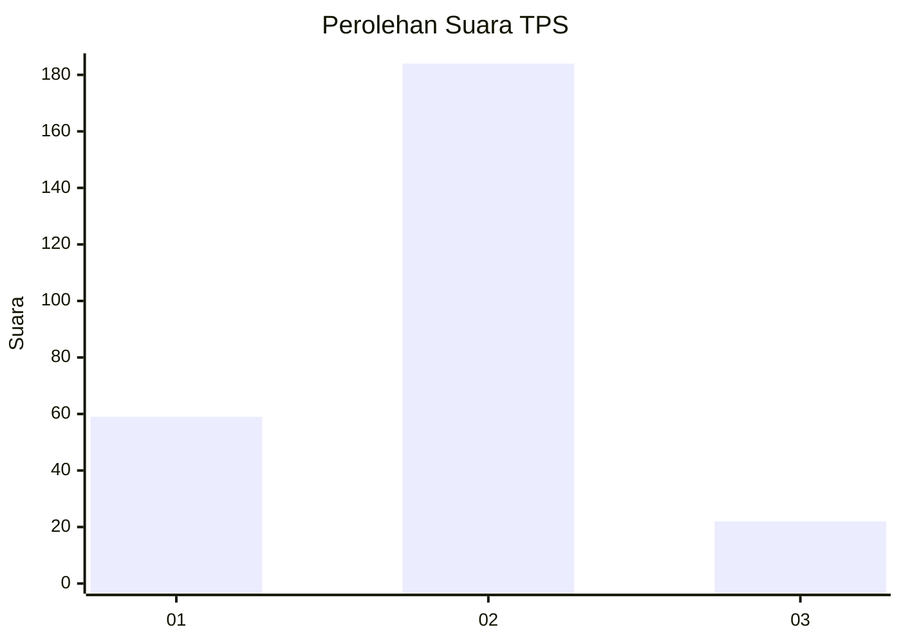
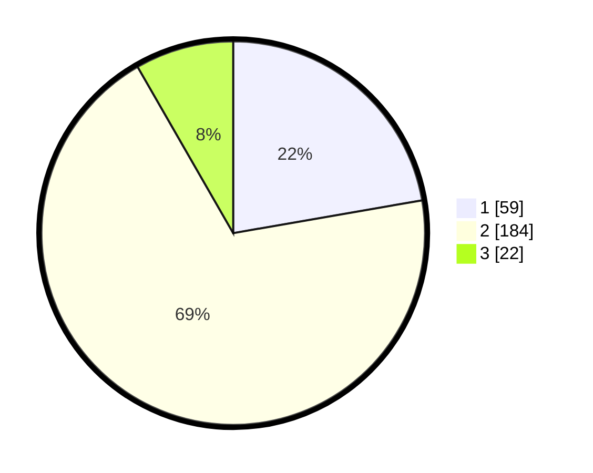

# Hasil

## Grafik

## Tabel

| No. | Nama Paslon    | Suara | Suara (raw) | Persentase |
|:--- |:-------------- | -----:| -----------:| ----------:|
| 1   | ANIES MUHAIMIN | 59    | [59][p-1]   | 22,26      |
| 2   | PRABOWO GIBRAN | 184   | [184][p-2]  | 69,43      |
| 3   | GANJAR MAHFUD  | 22    | [22][p-3]   | 8,30       |

[p-1]: https://github.com/gigit-pemilu/pemilu-2024-75-gorontalo/blob/main/pilpres/hitung-suara/sub/75-gorontalo/sub/04-pohuwato/sub/06-patilanggio/sub/2005-dulomo/sub/002-tps/sub/paslon-1.txt
[p-2]: https://github.com/gigit-pemilu/pemilu-2024-75-gorontalo/blob/main/pilpres/hitung-suara/sub/75-gorontalo/sub/04-pohuwato/sub/06-patilanggio/sub/2005-dulomo/sub/002-tps/sub/paslon-2.txt
[p-3]: https://github.com/gigit-pemilu/pemilu-2024-75-gorontalo/blob/main/pilpres/hitung-suara/sub/75-gorontalo/sub/04-pohuwato/sub/06-patilanggio/sub/2005-dulomo/sub/002-tps/sub/paslon-3.txt

## Foto C Plano

https://sirekap-obj-formc.kpu.go.id/82b2/pemilu/ppwp/75/04/06/20/05/7504062005002-20240220-083531--8777a012-b99d-443b-8aa6-6eb5614e428b.jpg

https://sirekap-obj-formc.kpu.go.id/82b2/pemilu/ppwp/75/04/06/20/05/7504062005002-20240220-083608--4da0fff7-f7ab-480a-9616-c0fb9170ea47.jpg

https://sirekap-obj-formc.kpu.go.id/82b2/pemilu/ppwp/75/04/06/20/05/7504062005002-20240220-083745--35462715-a834-4227-b49d-7ebea56e3ee3.jpg

## Metadata

| Key        | Value               |
| ---------- | ------------------- |
| Time Stamp | 2024-02-20 17:00:00 |

