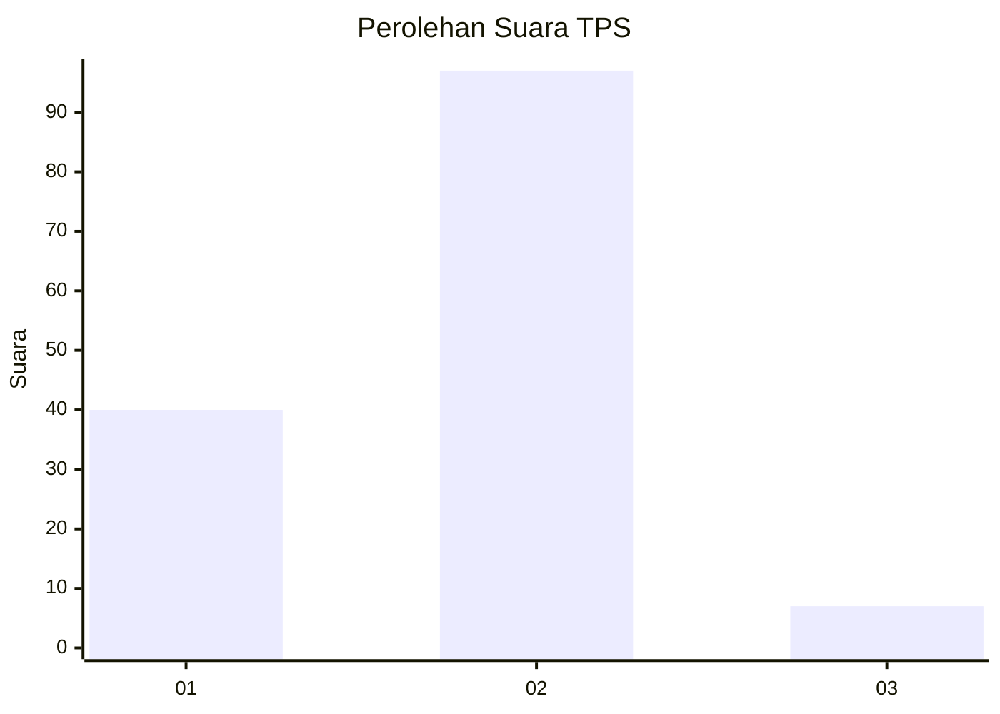
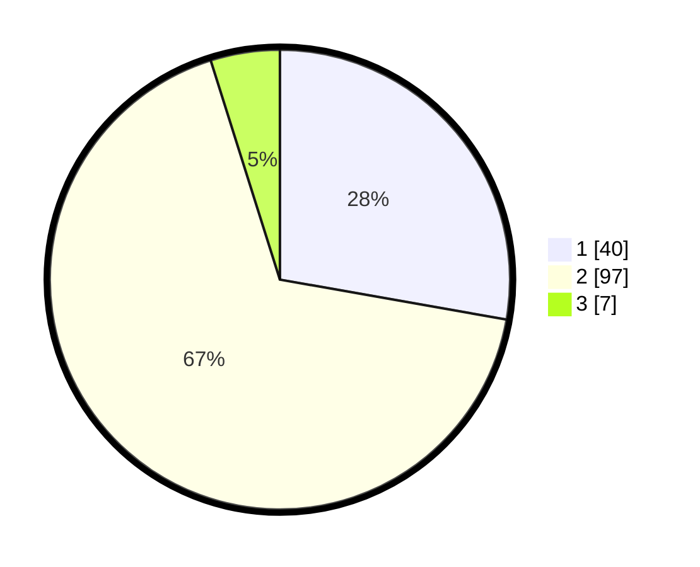

# Hasil

## Grafik

## Tabel

| No. | Nama Paslon    | Suara | Suara (raw) | Persentase |
|:--- |:-------------- | -----:| -----------:| ----------:|
| 1   | ANIES MUHAIMIN | 40    | [40][p-1]   | 27,78      |
| 2   | PRABOWO GIBRAN | 97    | [97][p-2]   | 67,36      |
| 3   | GANJAR MAHFUD  | 7     | [7][p-3]    | 4,86       |

[p-1]: https://github.com/gigit-pemilu/pemilu-2024-75-gorontalo/blob/main/pilpres/hitung-suara/sub/75-gorontalo/sub/04-pohuwato/sub/08-dengilo/sub/2001-popaya/sub/001-tps/sub/paslon-1.txt
[p-2]: https://github.com/gigit-pemilu/pemilu-2024-75-gorontalo/blob/main/pilpres/hitung-suara/sub/75-gorontalo/sub/04-pohuwato/sub/08-dengilo/sub/2001-popaya/sub/001-tps/sub/paslon-2.txt
[p-3]: https://github.com/gigit-pemilu/pemilu-2024-75-gorontalo/blob/main/pilpres/hitung-suara/sub/75-gorontalo/sub/04-pohuwato/sub/08-dengilo/sub/2001-popaya/sub/001-tps/sub/paslon-3.txt

## Foto C Plano

https://sirekap-obj-formc.kpu.go.id/344c/pemilu/ppwp/75/04/08/20/01/7504082001001-20240215-093843--9ee572fa-3185-450e-b67e-a7612c5ab9dc.jpg

https://sirekap-obj-formc.kpu.go.id/344c/pemilu/ppwp/75/04/08/20/01/7504082001001-20240215-072738--01b2aed1-84b7-4401-afe6-3fbdff769b96.jpg

https://sirekap-obj-formc.kpu.go.id/344c/pemilu/ppwp/75/04/08/20/01/7504082001001-20240215-073245--86a66307-c56b-44ce-8fb2-99af2d51c602.jpg

## Metadata

| Key        | Value               |
| ---------- | ------------------- |
| Time Stamp | 2024-02-24 22:31:28 |

