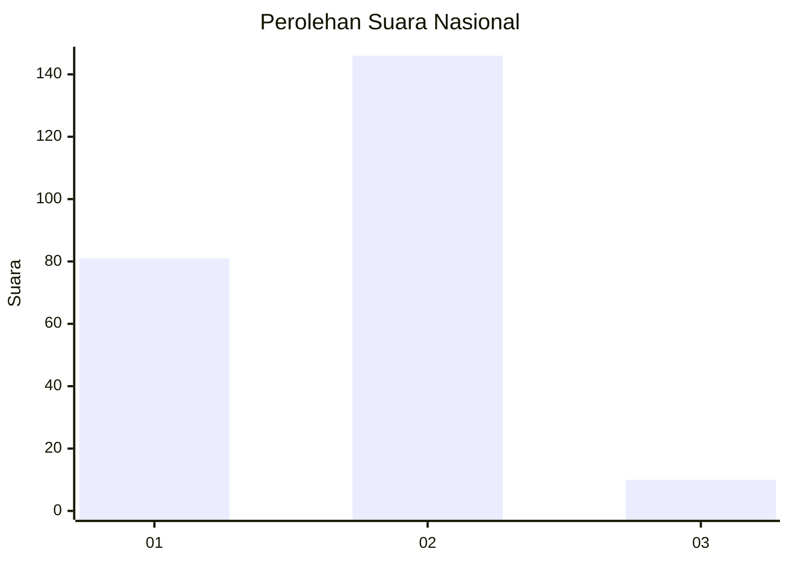
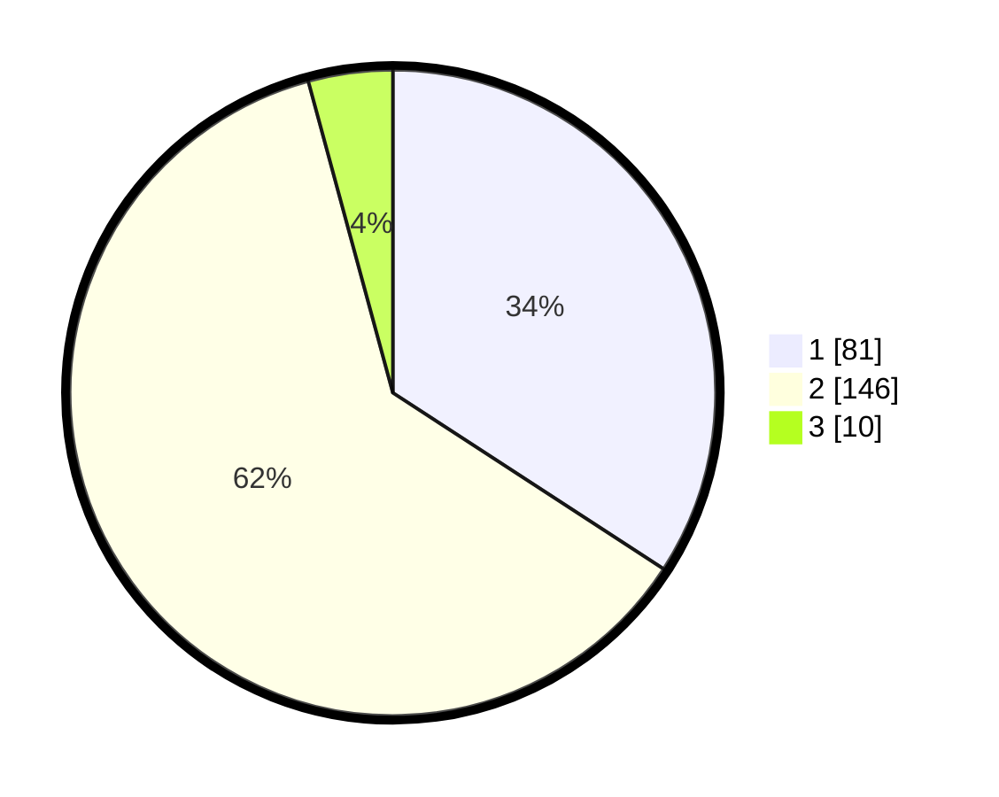

# Hasil

## Grafik

## Tabel

| No. | Nama Paslon    | Suara | Suara (raw) | Persentase |
|:--- |:-------------- | -----:| -----------:| ----------:|
| 1   | ANIES MUHAIMIN | 81    | [81][p-1]   | 34,18      |
| 2   | PRABOWO GIBRAN | 146   | [146][p-2]  | 61,60      |
| 3   | GANJAR MAHFUD  | 10    | [10][p-3]   | 4,22       |

[p-1]: https://github.com/gigit-pemilu/pemilu-2024/blob/main/pilpres/hitung-suara/sub/75-gorontalo/sub/04-pohuwato/sub/08-dengilo/sub/2001-popaya/sub/003-tps/sub/paslon-1.txt
[p-2]: https://github.com/gigit-pemilu/pemilu-2024/blob/main/pilpres/hitung-suara/sub/75-gorontalo/sub/04-pohuwato/sub/08-dengilo/sub/2001-popaya/sub/003-tps/sub/paslon-2.txt
[p-3]: https://github.com/gigit-pemilu/pemilu-2024/blob/main/pilpres/hitung-suara/sub/75-gorontalo/sub/04-pohuwato/sub/08-dengilo/sub/2001-popaya/sub/003-tps/sub/paslon-3.txt

## Foto C Plano

https://sirekap-obj-formc.kpu.go.id/1423/pemilu/ppwp/75/04/08/20/01/7504082001003-20240215-065218--cfbbef5e-82e3-4cce-b7e2-bda9bb34f271.jpg

https://sirekap-obj-formc.kpu.go.id/1423/pemilu/ppwp/75/04/08/20/01/7504082001003-20240215-075502--a4c24586-bc7c-44dd-bcc4-a7f5ece70faa.jpg

https://sirekap-obj-formc.kpu.go.id/1423/pemilu/ppwp/75/04/08/20/01/7504082001003-20240215-071247--846791de-3f67-4519-a602-23cea5f94cfa.jpg

## Metadata

| Key        | Value               |
| ---------- | ------------------- |
| Time Stamp | 2024-02-24 22:31:28 |

