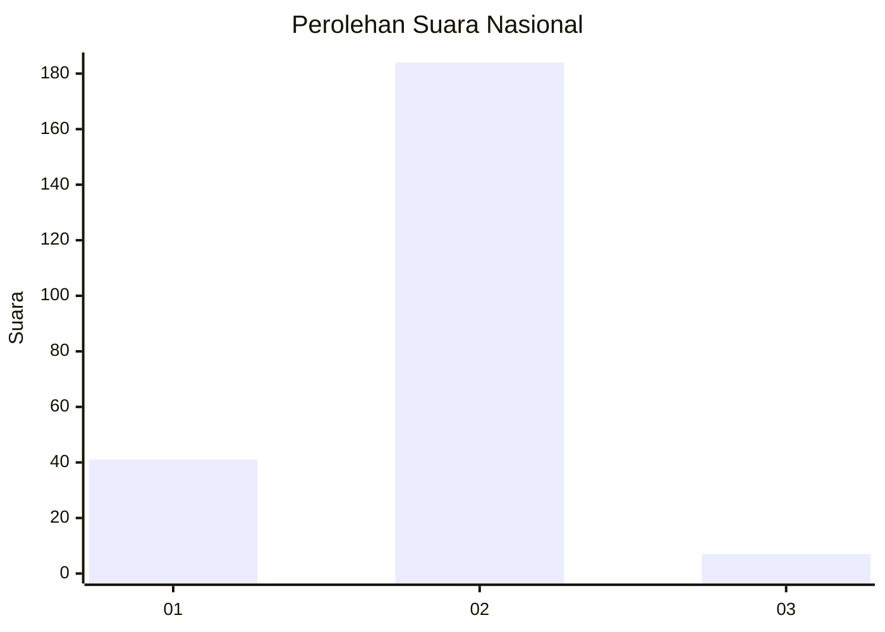
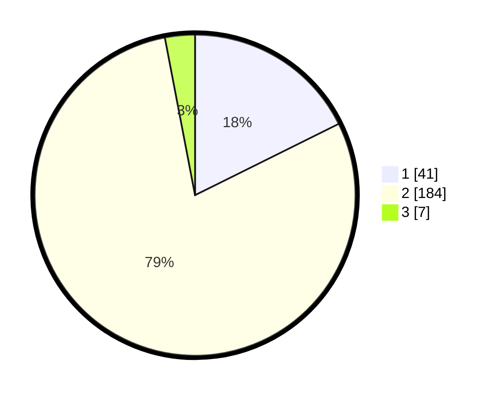

# Hasil

## Grafik

## Tabel

| No. | Nama Paslon    | Suara | Suara (raw) | Persentase |
|:--- |:-------------- | -----:| -----------:| ----------:|
| 1   | ANIES MUHAIMIN | 41    | [41][p-1]   | 17,67      |
| 2   | PRABOWO GIBRAN | 184   | [184][p-2]  | 79,31      |
| 3   | GANJAR MAHFUD  | 7     | [7][p-3]    | 3,02       |

[p-1]: https://github.com/gigit-pemilu/pemilu-2024/blob/main/pilpres/hitung-suara/sub/75-gorontalo/sub/04-pohuwato/sub/08-dengilo/sub/2001-popaya/sub/004-tps/sub/paslon-1.txt
[p-2]: https://github.com/gigit-pemilu/pemilu-2024/blob/main/pilpres/hitung-suara/sub/75-gorontalo/sub/04-pohuwato/sub/08-dengilo/sub/2001-popaya/sub/004-tps/sub/paslon-2.txt
[p-3]: https://github.com/gigit-pemilu/pemilu-2024/blob/main/pilpres/hitung-suara/sub/75-gorontalo/sub/04-pohuwato/sub/08-dengilo/sub/2001-popaya/sub/004-tps/sub/paslon-3.txt

## Foto C Plano

https://sirekap-obj-formc.kpu.go.id/8599/pemilu/ppwp/75/04/08/20/01/7504082001004-20240215-112759--04c099a5-1fbd-435f-ae64-bf4250674973.jpg

https://sirekap-obj-formc.kpu.go.id/8599/pemilu/ppwp/75/04/08/20/01/7504082001004-20240217-181717--5c794b24-caef-4ed3-9495-357f29f5b440.jpg

https://sirekap-obj-formc.kpu.go.id/8599/pemilu/ppwp/75/04/08/20/01/7504082001004-20240217-181831--5781e11d-e1a4-4088-abeb-7e6b4e73a5c2.jpg

## Metadata

| Key        | Value               |
| ---------- | ------------------- |
| Time Stamp | 2024-02-19 06:16:00 |

