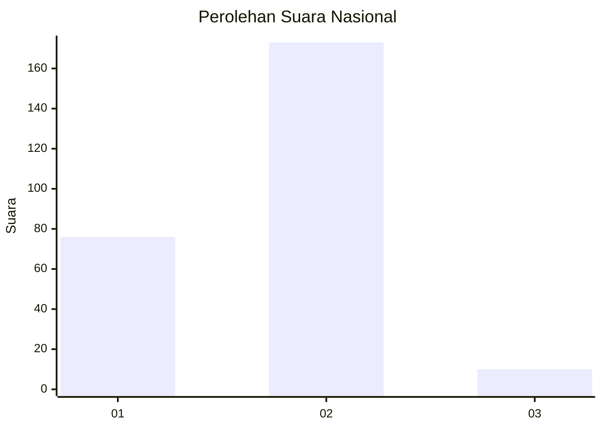
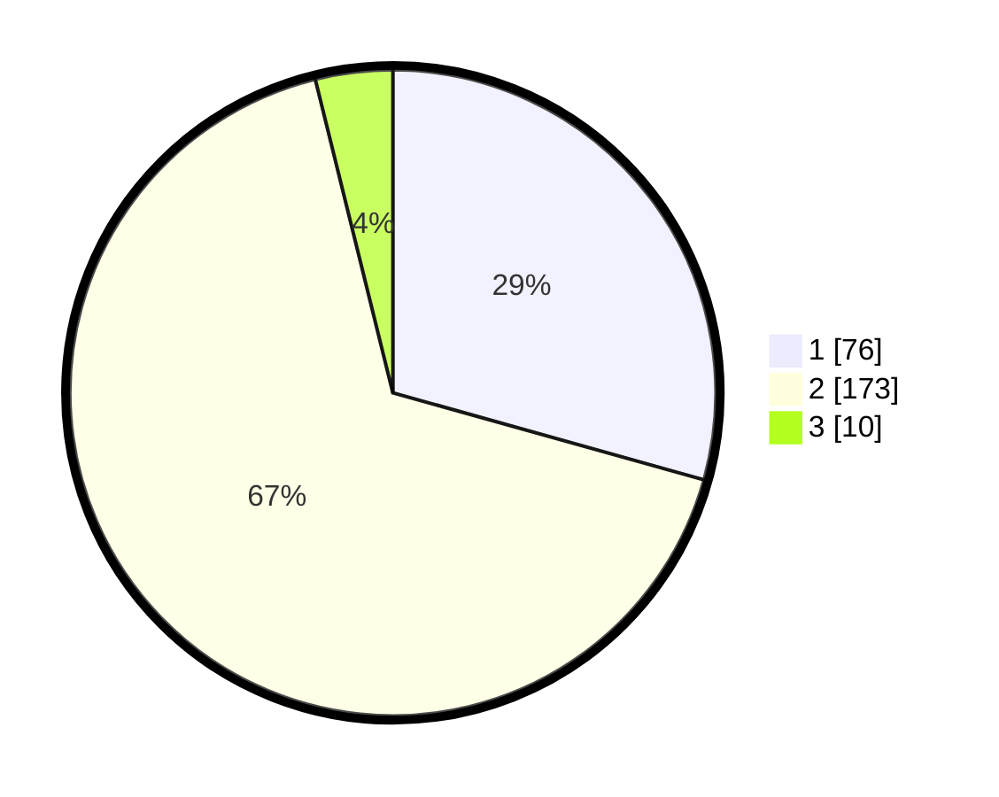

# Hasil

## Grafik

## Tabel

| No. | Nama Paslon    | Suara | Suara (raw) | Persentase |
|:--- |:-------------- | -----:| -----------:| ----------:|
| 1   | ANIES MUHAIMIN | 76    | [76][p-1]   | 29,34      |
| 2   | PRABOWO GIBRAN | 173   | [173][p-2]  | 66,80      |
| 3   | GANJAR MAHFUD  | 10    | [10][p-3]   | 3,86       |

[p-1]: https://github.com/gigit-pemilu/pemilu-2024/blob/main/pilpres/hitung-suara/sub/75-gorontalo/sub/04-pohuwato/sub/08-dengilo/sub/2001-popaya/sub/005-tps/sub/paslon-1.txt
[p-2]: https://github.com/gigit-pemilu/pemilu-2024/blob/main/pilpres/hitung-suara/sub/75-gorontalo/sub/04-pohuwato/sub/08-dengilo/sub/2001-popaya/sub/005-tps/sub/paslon-2.txt
[p-3]: https://github.com/gigit-pemilu/pemilu-2024/blob/main/pilpres/hitung-suara/sub/75-gorontalo/sub/04-pohuwato/sub/08-dengilo/sub/2001-popaya/sub/005-tps/sub/paslon-3.txt

## Foto C Plano

https://sirekap-obj-formc.kpu.go.id/c85e/pemilu/ppwp/75/04/08/20/01/7504082001005-20240215-084458--9968537b-b02f-4491-96f4-2d3e090f5ff0.jpg

https://sirekap-obj-formc.kpu.go.id/c85e/pemilu/ppwp/75/04/08/20/01/7504082001005-20240215-102509--fd307da6-7ed7-4a30-94dc-f2fdd0031820.jpg

https://sirekap-obj-formc.kpu.go.id/c85e/pemilu/ppwp/75/04/08/20/01/7504082001005-20240215-085733--a93c8b9f-3847-4302-85a0-9841314cf99c.jpg

## Metadata

| Key        | Value               |
| ---------- | ------------------- |
| Time Stamp | 2024-02-24 22:31:28 |

