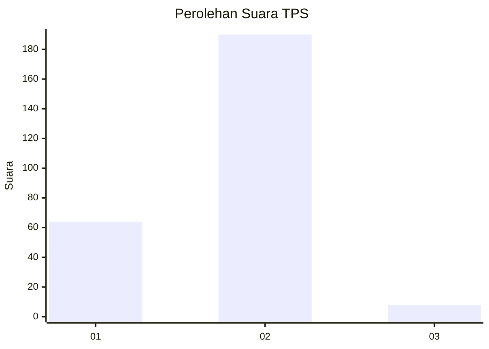
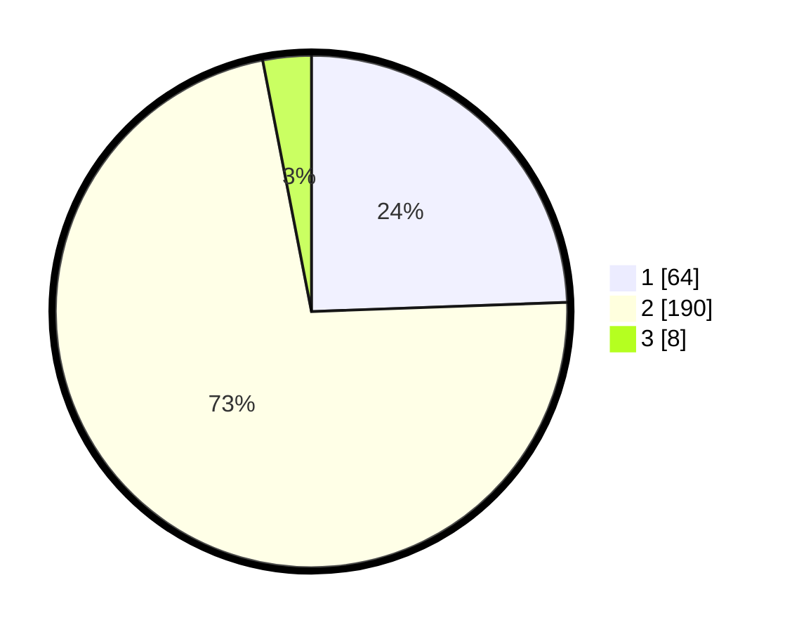

# Hasil

## Grafik

## Tabel

| No. | Nama Paslon    | Suara | Suara (raw) | Persentase |
|:--- |:-------------- | -----:| -----------:| ----------:|
| 1   | ANIES MUHAIMIN | 64    | [64][p-1]   | 24,43      |
| 2   | PRABOWO GIBRAN | 190   | [190][p-2]  | 72,52      |
| 3   | GANJAR MAHFUD  | 8     | [8][p-3]    | 3,05       |

[p-1]: https://github.com/gigit-pemilu/pemilu-2024-75-gorontalo/blob/main/pilpres/hitung-suara/sub/75-gorontalo/sub/04-pohuwato/sub/09-buntulia/sub/2001-hulawa/sub/002-tps/sub/paslon-1.txt
[p-2]: https://github.com/gigit-pemilu/pemilu-2024-75-gorontalo/blob/main/pilpres/hitung-suara/sub/75-gorontalo/sub/04-pohuwato/sub/09-buntulia/sub/2001-hulawa/sub/002-tps/sub/paslon-2.txt
[p-3]: https://github.com/gigit-pemilu/pemilu-2024-75-gorontalo/blob/main/pilpres/hitung-suara/sub/75-gorontalo/sub/04-pohuwato/sub/09-buntulia/sub/2001-hulawa/sub/002-tps/sub/paslon-3.txt

## Foto C Plano

https://sirekap-obj-formc.kpu.go.id/b7c5/pemilu/ppwp/75/04/09/20/01/7504092001002-20240215-104034--acf76bb8-2f80-4e00-a371-9110daf6ddc8.jpg

https://sirekap-obj-formc.kpu.go.id/b7c5/pemilu/ppwp/75/04/09/20/01/7504092001002-20240215-104442--9e5e5352-9e70-4e83-b323-1c53a862f08b.jpg

https://sirekap-obj-formc.kpu.go.id/b7c5/pemilu/ppwp/75/04/09/20/01/7504092001002-20240215-103925--97c8fb86-fb51-44ad-a6c6-dd247b66197e.jpg

## Metadata

| Key        | Value               |
| ---------- | ------------------- |
| Time Stamp | 2024-02-15 17:30:25 |

