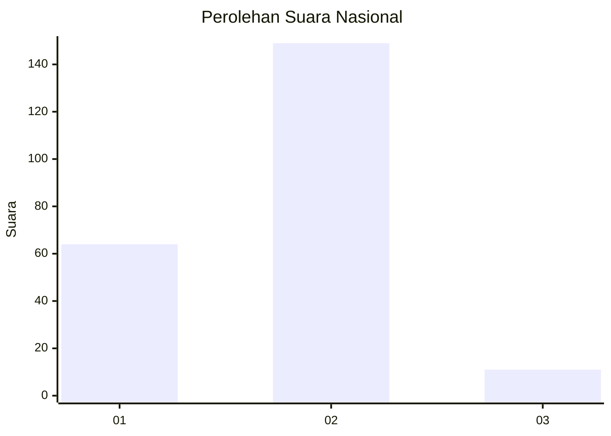
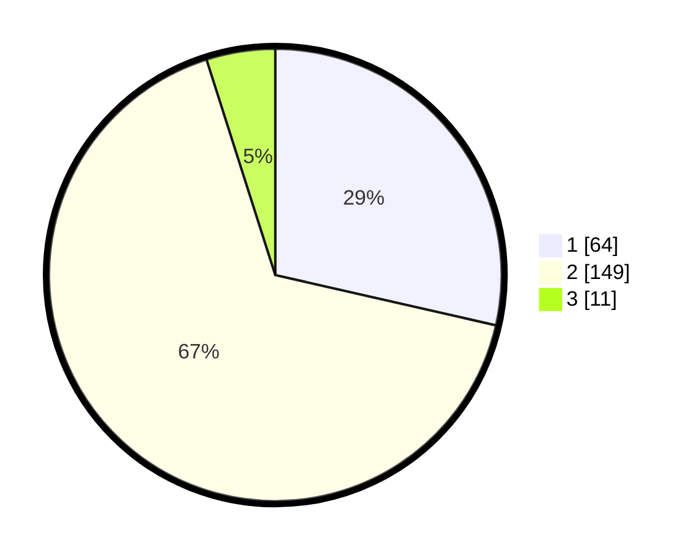

# Hasil

## Grafik

## Tabel

| No. | Nama Paslon    | Suara | Suara (raw) | Persentase |
|:--- |:-------------- | -----:| -----------:| ----------:|
| 1   | ANIES MUHAIMIN | 64    | [64][p-1]   | 28,57      |
| 2   | PRABOWO GIBRAN | 149   | [149][p-2]  | 66,52      |
| 3   | GANJAR MAHFUD  | 11    | [11][p-3]   | 4,91       |

[p-1]: https://github.com/gigit-pemilu/pemilu-2024/blob/main/pilpres/hitung-suara/sub/75-gorontalo/sub/04-pohuwato/sub/09-buntulia/sub/2001-hulawa/sub/003-tps/sub/paslon-1.txt
[p-2]: https://github.com/gigit-pemilu/pemilu-2024/blob/main/pilpres/hitung-suara/sub/75-gorontalo/sub/04-pohuwato/sub/09-buntulia/sub/2001-hulawa/sub/003-tps/sub/paslon-2.txt
[p-3]: https://github.com/gigit-pemilu/pemilu-2024/blob/main/pilpres/hitung-suara/sub/75-gorontalo/sub/04-pohuwato/sub/09-buntulia/sub/2001-hulawa/sub/003-tps/sub/paslon-3.txt

## Foto C Plano

https://sirekap-obj-formc.kpu.go.id/72bc/pemilu/ppwp/75/04/09/20/01/7504092001003-20240215-075605--aedca02d-3b04-40f3-bbcd-96eea7dd3451.jpg

https://sirekap-obj-formc.kpu.go.id/72bc/pemilu/ppwp/75/04/09/20/01/7504092001003-20240215-080019--e89cece5-79d2-48f3-8e7b-7d9f8bf2463d.jpg

https://sirekap-obj-formc.kpu.go.id/72bc/pemilu/ppwp/75/04/09/20/01/7504092001003-20240215-080406--a9b502ea-ee63-4a66-bafb-20f3ac7ce7b1.jpg

## Metadata

| Key        | Value               |
| ---------- | ------------------- |
| Time Stamp | 2024-02-24 22:31:28 |

