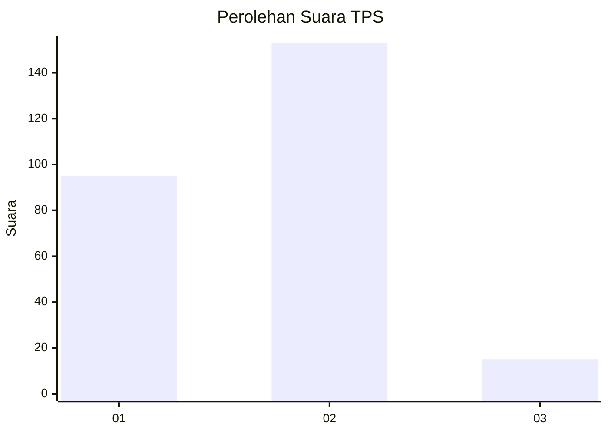
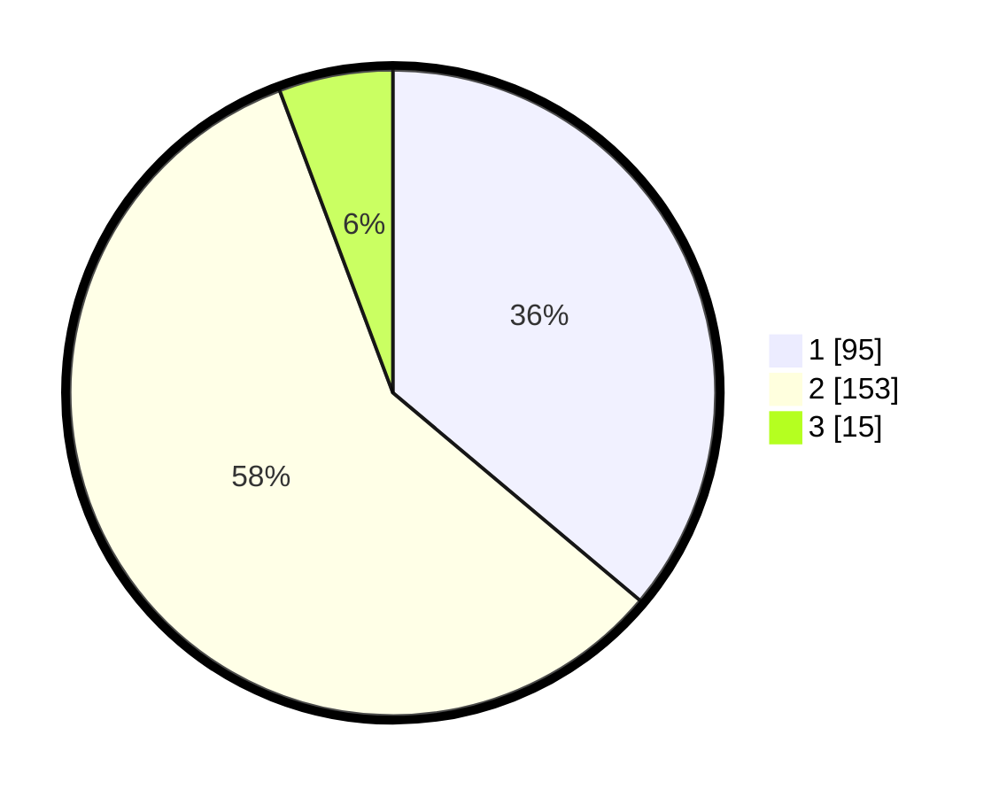

# Hasil

## Grafik

## Tabel

| No. | Nama Paslon    | Suara | Suara (raw) | Persentase |
|:--- |:-------------- | -----:| -----------:| ----------:|
| 1   | ANIES MUHAIMIN | 95    | [95][p-1]   | 36,12      |
| 2   | PRABOWO GIBRAN | 153   | [153][p-2]  | 58,17      |
| 3   | GANJAR MAHFUD  | 15    | [15][p-3]   | 5,70       |

[p-1]: https://github.com/gigit-pemilu/pemilu-2024-75-gorontalo/blob/main/pilpres/hitung-suara/sub/75-gorontalo/sub/04-pohuwato/sub/09-buntulia/sub/2002-karya-indah/sub/003-tps/sub/paslon-1.txt
[p-2]: https://github.com/gigit-pemilu/pemilu-2024-75-gorontalo/blob/main/pilpres/hitung-suara/sub/75-gorontalo/sub/04-pohuwato/sub/09-buntulia/sub/2002-karya-indah/sub/003-tps/sub/paslon-2.txt
[p-3]: https://github.com/gigit-pemilu/pemilu-2024-75-gorontalo/blob/main/pilpres/hitung-suara/sub/75-gorontalo/sub/04-pohuwato/sub/09-buntulia/sub/2002-karya-indah/sub/003-tps/sub/paslon-3.txt

## Foto C Plano

https://sirekap-obj-formc.kpu.go.id/388f/pemilu/ppwp/75/04/09/20/02/7504092002003-20240215-084451--c95aff67-2b0f-4451-aa0d-6661f21e631a.jpg

https://sirekap-obj-formc.kpu.go.id/388f/pemilu/ppwp/75/04/09/20/02/7504092002003-20240215-084845--2ecc94da-777f-4160-85dc-90224503326a.jpg

https://sirekap-obj-formc.kpu.go.id/388f/pemilu/ppwp/75/04/09/20/02/7504092002003-20240215-085441--5c814760-6488-4860-a54f-c2c194704308.jpg

## Metadata

| Key        | Value               |
| ---------- | ------------------- |
| Time Stamp | 2024-02-24 22:31:28 |

