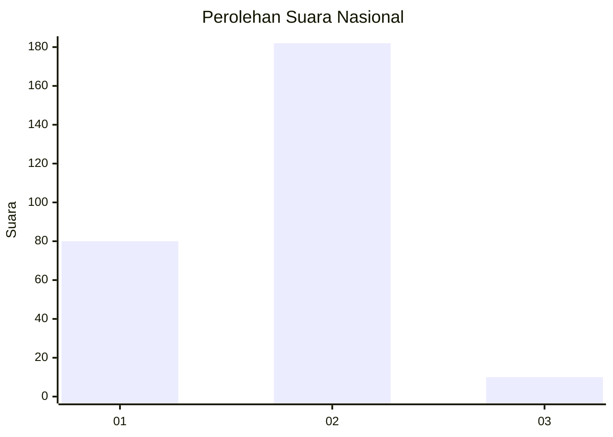
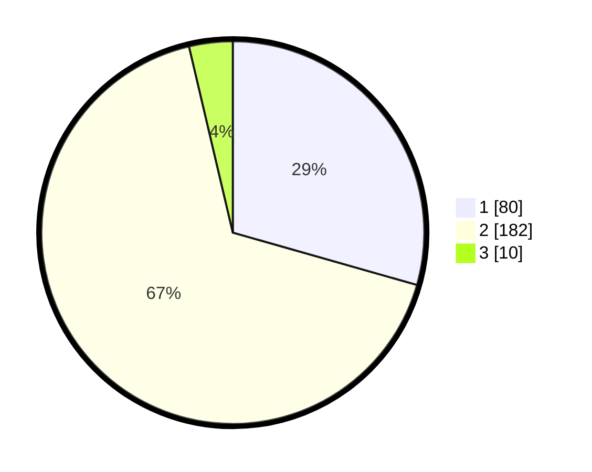

# Hasil

## Grafik

## Tabel

| No. | Nama Paslon    | Suara | Suara (raw) | Persentase |
|:--- |:-------------- | -----:| -----------:| ----------:|
| 1   | ANIES MUHAIMIN | 80    | [80][p-1]   | 29,41      |
| 2   | PRABOWO GIBRAN | 182   | [182][p-2]  | 66,91      |
| 3   | GANJAR MAHFUD  | 10    | [10][p-3]   | 3,68       |

[p-1]: https://github.com/gigit-pemilu/pemilu-2024/blob/main/pilpres/hitung-suara/sub/75-gorontalo/sub/04-pohuwato/sub/09-buntulia/sub/2003-taluduyunu/sub/001-tps/sub/paslon-1.txt
[p-2]: https://github.com/gigit-pemilu/pemilu-2024/blob/main/pilpres/hitung-suara/sub/75-gorontalo/sub/04-pohuwato/sub/09-buntulia/sub/2003-taluduyunu/sub/001-tps/sub/paslon-2.txt
[p-3]: https://github.com/gigit-pemilu/pemilu-2024/blob/main/pilpres/hitung-suara/sub/75-gorontalo/sub/04-pohuwato/sub/09-buntulia/sub/2003-taluduyunu/sub/001-tps/sub/paslon-3.txt

## Foto C Plano

https://sirekap-obj-formc.kpu.go.id/f9ee/pemilu/ppwp/75/04/09/20/03/7504092003001-20240214-192951--848033d2-2b08-4751-882d-69057e17468d.jpg

https://sirekap-obj-formc.kpu.go.id/f9ee/pemilu/ppwp/75/04/09/20/03/7504092003001-20240214-192721--1171a6fe-e561-47cc-a400-9a96553528ba.jpg

https://sirekap-obj-formc.kpu.go.id/f9ee/pemilu/ppwp/75/04/09/20/03/7504092003001-20240214-191942--f3d111f6-caaf-48e9-b76e-b8a3ee0b2481.jpg

## Metadata

| Key        | Value               |
| ---------- | ------------------- |
| Time Stamp | 2024-02-25 11:00:00 |

