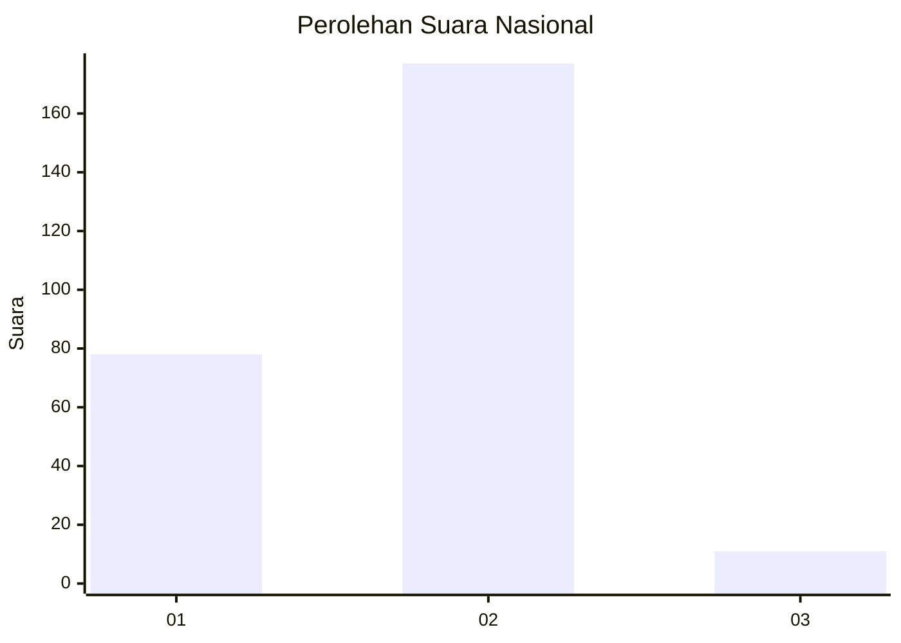
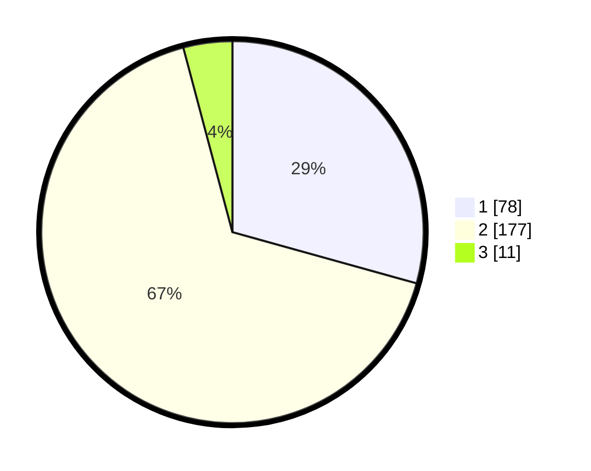

# Hasil

## Grafik

## Tabel

| No. | Nama Paslon    | Suara | Suara (raw) | Persentase |
|:--- |:-------------- | -----:| -----------:| ----------:|
| 1   | ANIES MUHAIMIN | 78    | [78][p-1]   | 29,32      |
| 2   | PRABOWO GIBRAN | 177   | [177][p-2]  | 66,54      |
| 3   | GANJAR MAHFUD  | 11    | [11][p-3]   | 4,14       |

[p-1]: https://github.com/gigit-pemilu/pemilu-2024/blob/main/pilpres/hitung-suara/sub/75-gorontalo/sub/04-pohuwato/sub/09-buntulia/sub/2006-taluduyunu-utara/sub/002-tps/sub/paslon-1.txt
[p-2]: https://github.com/gigit-pemilu/pemilu-2024/blob/main/pilpres/hitung-suara/sub/75-gorontalo/sub/04-pohuwato/sub/09-buntulia/sub/2006-taluduyunu-utara/sub/002-tps/sub/paslon-2.txt
[p-3]: https://github.com/gigit-pemilu/pemilu-2024/blob/main/pilpres/hitung-suara/sub/75-gorontalo/sub/04-pohuwato/sub/09-buntulia/sub/2006-taluduyunu-utara/sub/002-tps/sub/paslon-3.txt

## Foto C Plano

https://sirekap-obj-formc.kpu.go.id/f29d/pemilu/ppwp/75/04/09/20/06/7504092006002-20240215-073706--9459db1d-44aa-42f8-9e35-cc44c5ed6313.jpg

https://sirekap-obj-formc.kpu.go.id/f29d/pemilu/ppwp/75/04/09/20/06/7504092006002-20240215-074234--37569989-a030-459c-b7ef-384e73d0e7a9.jpg

https://sirekap-obj-formc.kpu.go.id/f29d/pemilu/ppwp/75/04/09/20/06/7504092006002-20240215-083953--69f60bb1-eb2e-4af5-97fd-f2b574e1b562.jpg

## Metadata

| Key        | Value               |
| ---------- | ------------------- |
| Time Stamp | 2024-02-24 22:31:28 |

