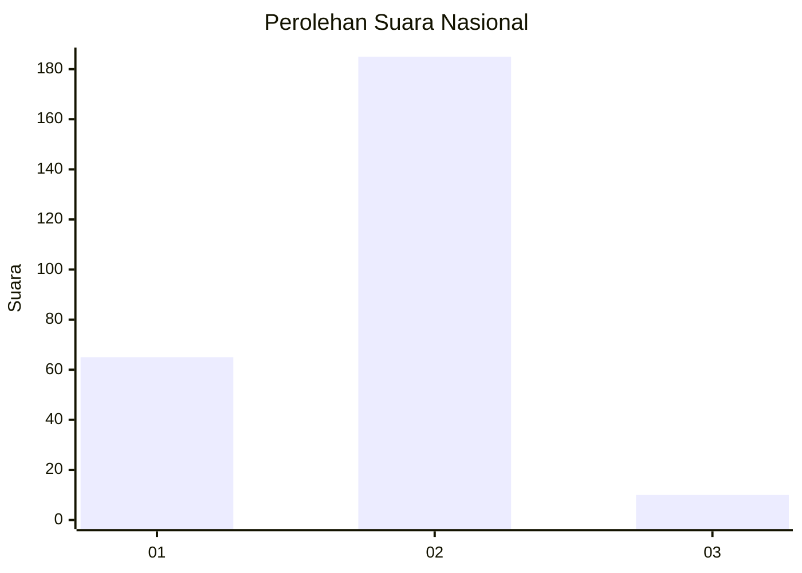
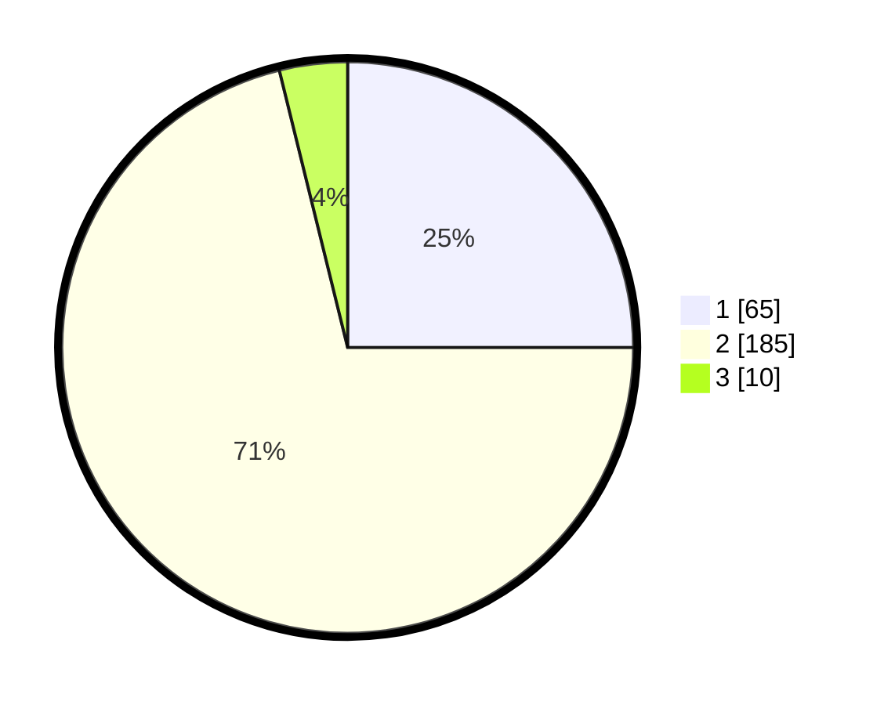

# Hasil

## Grafik

## Tabel

| No. | Nama Paslon    | Suara | Suara (raw) | Persentase |
|:--- |:-------------- | -----:| -----------:| ----------:|
| 1   | ANIES MUHAIMIN | 65    | [65][p-1]   | 25,00      |
| 2   | PRABOWO GIBRAN | 185   | [185][p-2]  | 71,15      |
| 3   | GANJAR MAHFUD  | 10    | [10][p-3]   | 3,85       |

[p-1]: https://github.com/gigit-pemilu/pemilu-2024/blob/main/pilpres/hitung-suara/sub/75-gorontalo/sub/04-pohuwato/sub/10-duhiadaa/sub/2006-buntulia-jaya/sub/004-tps/sub/paslon-1.txt
[p-2]: https://github.com/gigit-pemilu/pemilu-2024/blob/main/pilpres/hitung-suara/sub/75-gorontalo/sub/04-pohuwato/sub/10-duhiadaa/sub/2006-buntulia-jaya/sub/004-tps/sub/paslon-2.txt
[p-3]: https://github.com/gigit-pemilu/pemilu-2024/blob/main/pilpres/hitung-suara/sub/75-gorontalo/sub/04-pohuwato/sub/10-duhiadaa/sub/2006-buntulia-jaya/sub/004-tps/sub/paslon-3.txt

## Foto C Plano

https://sirekap-obj-formc.kpu.go.id/7cad/pemilu/ppwp/75/04/10/20/06/7504102006004-20240215-085309--8abe6179-3fb3-47ca-89cd-22c01f080088.jpg

https://sirekap-obj-formc.kpu.go.id/7cad/pemilu/ppwp/75/04/10/20/06/7504102006004-20240215-085417--f66c37c6-18c4-4177-a7aa-70f308389ffc.jpg

https://sirekap-obj-formc.kpu.go.id/7cad/pemilu/ppwp/75/04/10/20/06/7504102006004-20240215-085527--802c2823-0e6e-45a6-b6c9-9e55cf79a2c2.jpg

## Metadata

| Key        | Value               |
| ---------- | ------------------- |
| Time Stamp | 2024-02-24 22:31:28 |

