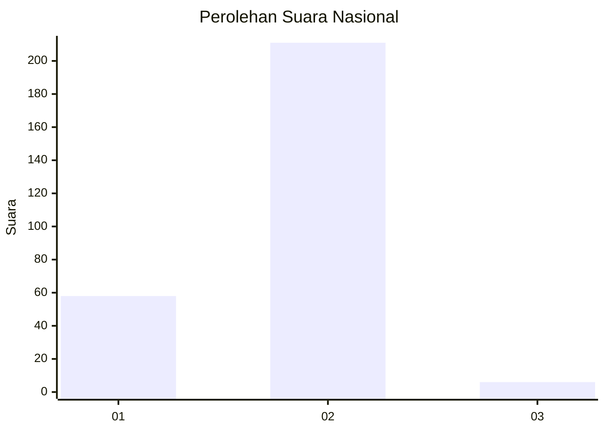
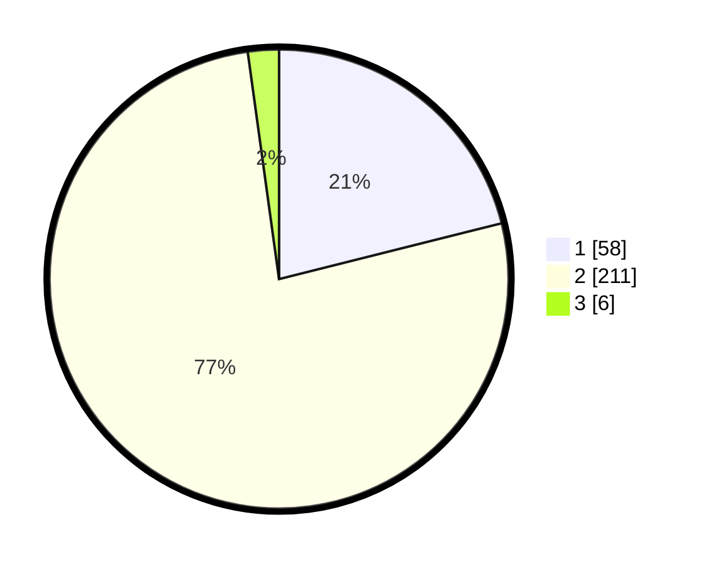

# Hasil

## Grafik

## Tabel

| No. | Nama Paslon    | Suara | Suara (raw) | Persentase |
|:--- |:-------------- | -----:| -----------:| ----------:|
| 1   | ANIES MUHAIMIN | 58    | [58][p-1]   | 21,09      |
| 2   | PRABOWO GIBRAN | 211   | [211][p-2]  | 76,73      |
| 3   | GANJAR MAHFUD  | 6     | [6][p-3]    | 2,18       |

[p-1]: https://github.com/gigit-pemilu/pemilu-2024/blob/main/pilpres/hitung-suara/sub/75-gorontalo/sub/04-pohuwato/sub/10-duhiadaa/sub/2008-mootilango/sub/003-tps/sub/paslon-1.txt
[p-2]: https://github.com/gigit-pemilu/pemilu-2024/blob/main/pilpres/hitung-suara/sub/75-gorontalo/sub/04-pohuwato/sub/10-duhiadaa/sub/2008-mootilango/sub/003-tps/sub/paslon-2.txt
[p-3]: https://github.com/gigit-pemilu/pemilu-2024/blob/main/pilpres/hitung-suara/sub/75-gorontalo/sub/04-pohuwato/sub/10-duhiadaa/sub/2008-mootilango/sub/003-tps/sub/paslon-3.txt

## Foto C Plano

https://sirekap-obj-formc.kpu.go.id/6b8f/pemilu/ppwp/75/04/10/20/08/7504102008003-20240306-130128--a80c6c8d-4dd5-4506-b151-9246bb24823c.jpg

https://sirekap-obj-formc.kpu.go.id/6b8f/pemilu/ppwp/75/04/10/20/08/7504102008003-20240215-102420--e19ade50-c3ec-47e7-9ed2-e325fe3e7d28.jpg

https://sirekap-obj-formc.kpu.go.id/6b8f/pemilu/ppwp/75/04/10/20/08/7504102008003-20240215-102534--e405299a-75a8-4fcc-873e-436f266e978e.jpg

## Metadata

| Key        | Value               |
| ---------- | ------------------- |
| Time Stamp | 2024-03-06 14:00:00 |

