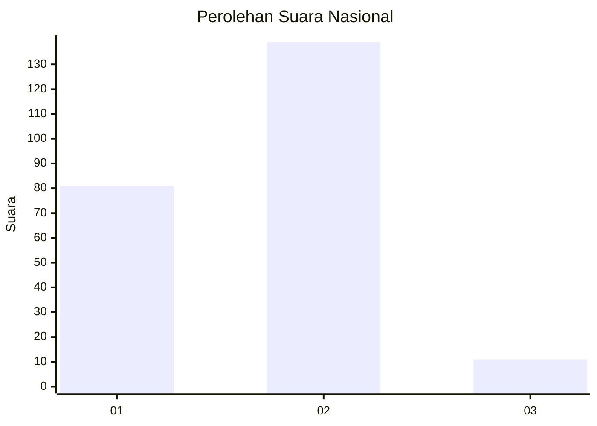
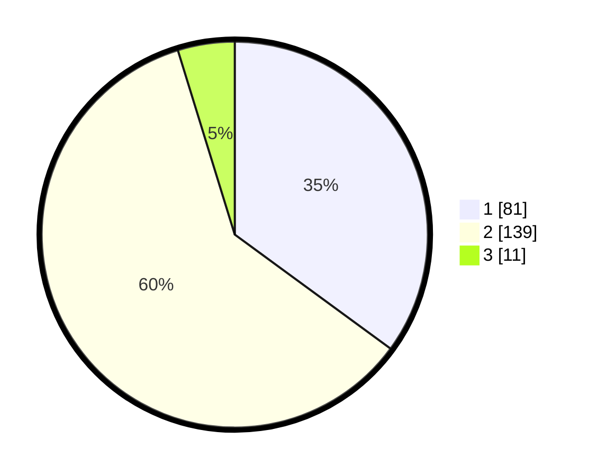

# Hasil

## Grafik

## Tabel

| No. | Nama Paslon    | Suara | Suara (raw) | Persentase |
|:--- |:-------------- | -----:| -----------:| ----------:|
| 1   | ANIES MUHAIMIN | 81    | [81][p-1]   | 35,06      |
| 2   | PRABOWO GIBRAN | 139   | [139][p-2]  | 60,17      |
| 3   | GANJAR MAHFUD  | 11    | [11][p-3]   | 4,76       |

[p-1]: https://github.com/gigit-pemilu/pemilu-2024/blob/main/pilpres/hitung-suara/sub/75-gorontalo/sub/04-pohuwato/sub/12-popayato-timur/sub/2001-milangodaa/sub/001-tps/sub/paslon-1.txt
[p-2]: https://github.com/gigit-pemilu/pemilu-2024/blob/main/pilpres/hitung-suara/sub/75-gorontalo/sub/04-pohuwato/sub/12-popayato-timur/sub/2001-milangodaa/sub/001-tps/sub/paslon-2.txt
[p-3]: https://github.com/gigit-pemilu/pemilu-2024/blob/main/pilpres/hitung-suara/sub/75-gorontalo/sub/04-pohuwato/sub/12-popayato-timur/sub/2001-milangodaa/sub/001-tps/sub/paslon-3.txt

## Foto C Plano

https://sirekap-obj-formc.kpu.go.id/5f42/pemilu/ppwp/75/04/12/20/01/7504122001001-20240215-062837--87f6a404-2c50-4c8f-bb28-cb7186582795.jpg

https://sirekap-obj-formc.kpu.go.id/5f42/pemilu/ppwp/75/04/12/20/01/7504122001001-20240215-062440--570f181d-60f6-4523-86e9-b938f1cc14e4.jpg

https://sirekap-obj-formc.kpu.go.id/5f42/pemilu/ppwp/75/04/12/20/01/7504122001001-20240215-063120--f7ded279-d9c8-4ecb-b979-64b1ffc4dd28.jpg

## Metadata

| Key        | Value               |
| ---------- | ------------------- |
| Time Stamp | 2024-02-21 16:00:00 |

