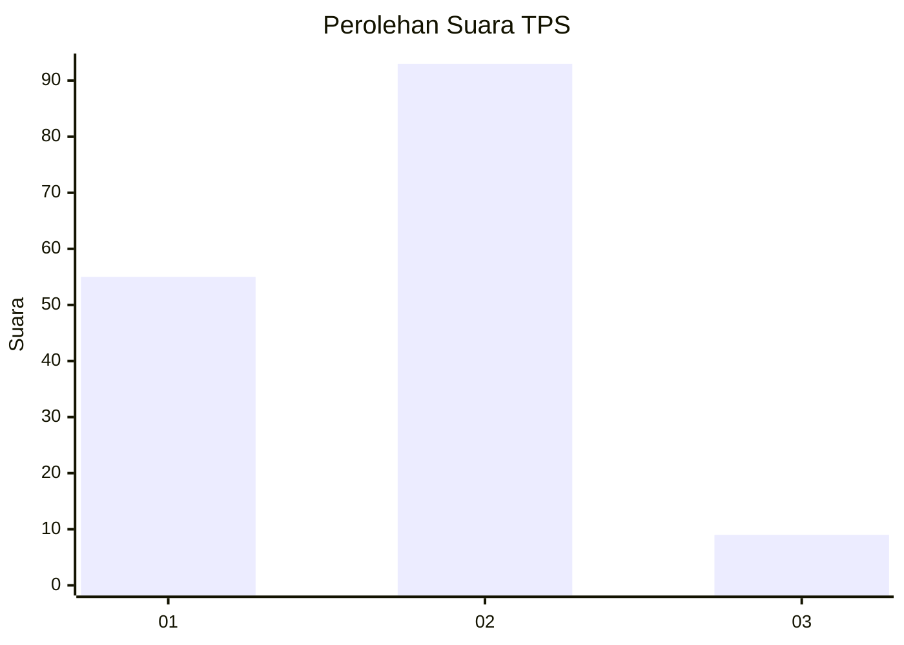
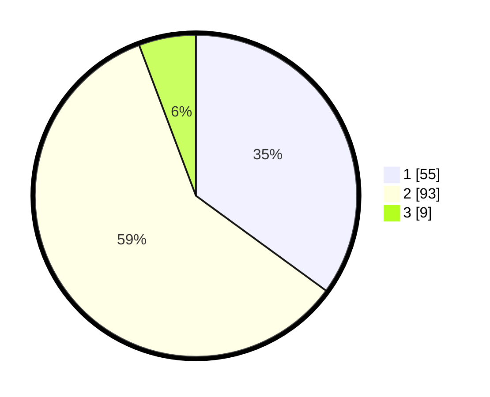

# Hasil

## Grafik

## Tabel

| No. | Nama Paslon    | Suara | Suara (raw) | Persentase |
|:--- |:-------------- | -----:| -----------:| ----------:|
| 1   | ANIES MUHAIMIN | 55    | [55][p-1]   | 35,03      |
| 2   | PRABOWO GIBRAN | 93    | [93][p-2]   | 59,24      |
| 3   | GANJAR MAHFUD  | 9     | [9][p-3]    | 5,73       |

[p-1]: https://github.com/gigit-pemilu/pemilu-2024-75-gorontalo/blob/main/pilpres/hitung-suara/sub/75-gorontalo/sub/04-pohuwato/sub/12-popayato-timur/sub/2001-milangodaa/sub/005-tps/sub/paslon-1.txt
[p-2]: https://github.com/gigit-pemilu/pemilu-2024-75-gorontalo/blob/main/pilpres/hitung-suara/sub/75-gorontalo/sub/04-pohuwato/sub/12-popayato-timur/sub/2001-milangodaa/sub/005-tps/sub/paslon-2.txt
[p-3]: https://github.com/gigit-pemilu/pemilu-2024-75-gorontalo/blob/main/pilpres/hitung-suara/sub/75-gorontalo/sub/04-pohuwato/sub/12-popayato-timur/sub/2001-milangodaa/sub/005-tps/sub/paslon-3.txt

## Foto C Plano

https://sirekap-obj-formc.kpu.go.id/339e/pemilu/ppwp/75/04/12/20/01/7504122001005-20240215-034757--d12eb477-658f-4f4a-84c9-2d39373d82d0.jpg

https://sirekap-obj-formc.kpu.go.id/339e/pemilu/ppwp/75/04/12/20/01/7504122001005-20240215-000333--dab55f9d-6c4c-4348-9950-bb0ea9147bbd.jpg

https://sirekap-obj-formc.kpu.go.id/339e/pemilu/ppwp/75/04/12/20/01/7504122001005-20240214-213537--6833d98a-5a85-445c-9663-1068ef1dcf55.jpg

## Metadata

| Key        | Value               |
| ---------- | ------------------- |
| Time Stamp | 2024-02-24 22:31:28 |

