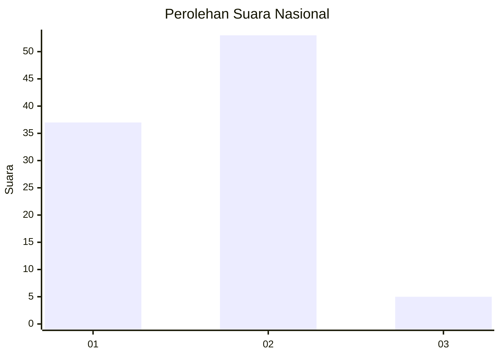
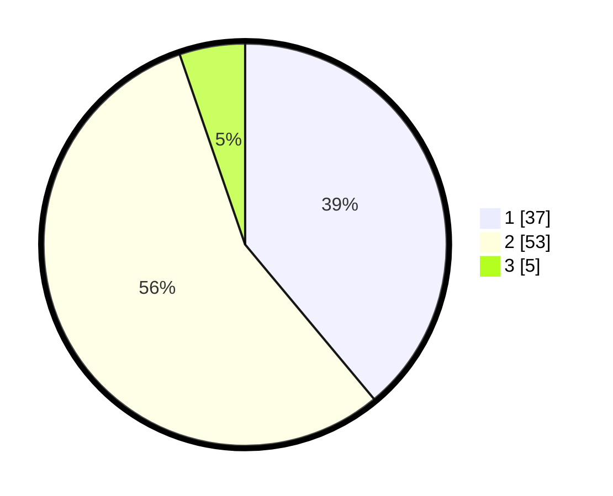

# Hasil

## Grafik

## Tabel

| No. | Nama Paslon    | Suara | Suara (raw) | Persentase |
|:--- |:-------------- | -----:| -----------:| ----------:|
| 1   | ANIES MUHAIMIN | 37    | [37][p-1]   | 38,95      |
| 2   | PRABOWO GIBRAN | 53    | [53][p-2]   | 55,79      |
| 3   | GANJAR MAHFUD  | 5     | [5][p-3]    | 5,26       |

[p-1]: https://github.com/gigit-pemilu/pemilu-2024/blob/main/pilpres/hitung-suara/sub/75-gorontalo/sub/05-gorontalo-utara/sub/02-kwandang/sub/2017-katialada/sub/007-tps/sub/paslon-1.txt
[p-2]: https://github.com/gigit-pemilu/pemilu-2024/blob/main/pilpres/hitung-suara/sub/75-gorontalo/sub/05-gorontalo-utara/sub/02-kwandang/sub/2017-katialada/sub/007-tps/sub/paslon-2.txt
[p-3]: https://github.com/gigit-pemilu/pemilu-2024/blob/main/pilpres/hitung-suara/sub/75-gorontalo/sub/05-gorontalo-utara/sub/02-kwandang/sub/2017-katialada/sub/007-tps/sub/paslon-3.txt

## Foto C Plano

https://sirekap-obj-formc.kpu.go.id/8d3e/pemilu/ppwp/75/05/02/20/17/7505022017007-20240214-140943--5c280fca-4260-4e72-a47a-c6a7845727d2.jpg

https://sirekap-obj-formc.kpu.go.id/8d3e/pemilu/ppwp/75/05/02/20/17/7505022017007-20240214-200319--b6d6775e-3e9a-4eee-8cf6-5daef33f50cf.jpg

https://sirekap-obj-formc.kpu.go.id/8d3e/pemilu/ppwp/75/05/02/20/17/7505022017007-20240215-002850--f87bbafa-9c18-486c-8041-c9b34f2f163f.jpg

## Metadata

| Key        | Value               |
| ---------- | ------------------- |
| Time Stamp | 2024-02-15 04:00:24 |

