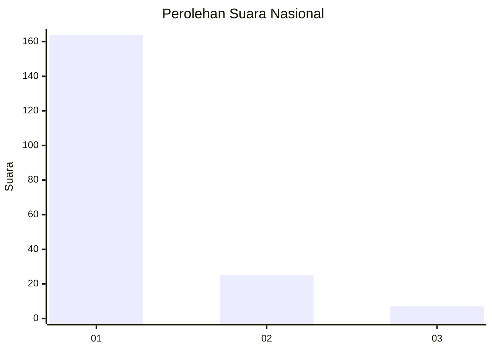
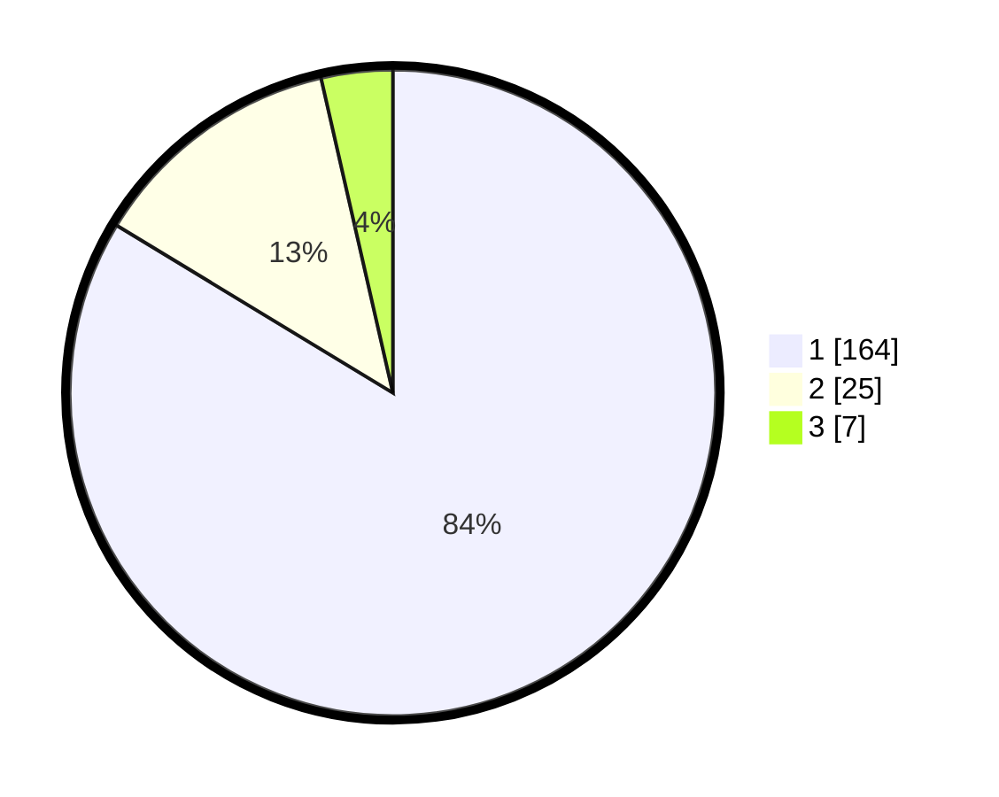

# Hasil

## Grafik

## Tabel

| No. | Nama Paslon    | Suara | Suara (raw) | Persentase |
|:--- |:-------------- | -----:| -----------:| ----------:|
| 1   | ANIES MUHAIMIN | 164   | [164][p-1]  | 83,67      |
| 2   | PRABOWO GIBRAN | 25    | [25][p-2]   | 12,76      |
| 3   | GANJAR MAHFUD  | 7     | [7][p-3]    | 3,57       |

[p-1]: https://github.com/gigit-pemilu/pemilu-2024/blob/main/pilpres/hitung-suara/sub/75-gorontalo/sub/71-kota-gorontalo/sub/02-kota-selatan/sub/1020-limba-u-ii/sub/010-tps/sub/paslon-1.txt
[p-2]: https://github.com/gigit-pemilu/pemilu-2024/blob/main/pilpres/hitung-suara/sub/75-gorontalo/sub/71-kota-gorontalo/sub/02-kota-selatan/sub/1020-limba-u-ii/sub/010-tps/sub/paslon-2.txt
[p-3]: https://github.com/gigit-pemilu/pemilu-2024/blob/main/pilpres/hitung-suara/sub/75-gorontalo/sub/71-kota-gorontalo/sub/02-kota-selatan/sub/1020-limba-u-ii/sub/010-tps/sub/paslon-3.txt

## Foto C Plano

https://sirekap-obj-formc.kpu.go.id/442a/pemilu/ppwp/75/71/02/10/20/7571021020010-20240221-133545--bfd838f5-3038-4968-a580-0382f7c8453f.jpg

https://sirekap-obj-formc.kpu.go.id/442a/pemilu/ppwp/75/71/02/10/20/7571021020010-20240221-133624--4af70e96-f8d1-40c9-a8c4-0f3b244b508b.jpg

https://sirekap-obj-formc.kpu.go.id/442a/pemilu/ppwp/75/71/02/10/20/7571021020010-20240221-133701--7500d24b-b4ac-4c7a-8469-3b3bc3360d55.jpg

## Metadata

| Key        | Value               |
| ---------- | ------------------- |
| Time Stamp | 2024-02-21 14:00:00 |

## DATA PEMILIH TETAP

Jumlah pemilih dalam DPT: **280**.
 * L: **171**.
 * P: **144**.

## DATA PENGGUNA HAK PILIH

Jumlah pengguna hak pilih dalam DPT: **255**.
 * L: **502**.
 * P: **555**.

Jumlah pengguna hak pilih dalam DPTb: **4**.
 * L: **1**.
 * P: **7**.

Jumlah pengguna hak pilih dalam DPK: **14**.
 * L: **2**.
 * P: **4**.

Jumlah pengguna hak pilih: **544**.
 * L: **113**.
 * P: **135**.

## JUMLAH SUARA SAH DAN TIDAK SAH

JUMLAH SELURUH SUARA SAH: **245**.

JUMLAH SUARA TIDAK SAH: **2**.

JUMLAH SELURUH SUARA SAH DAN SUARA TIDAK SAH: **248**.

