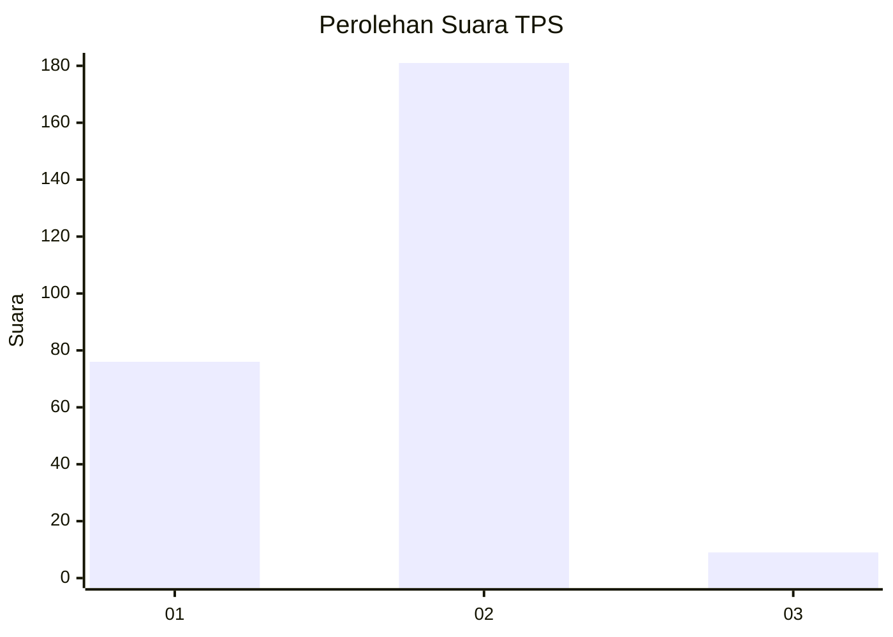
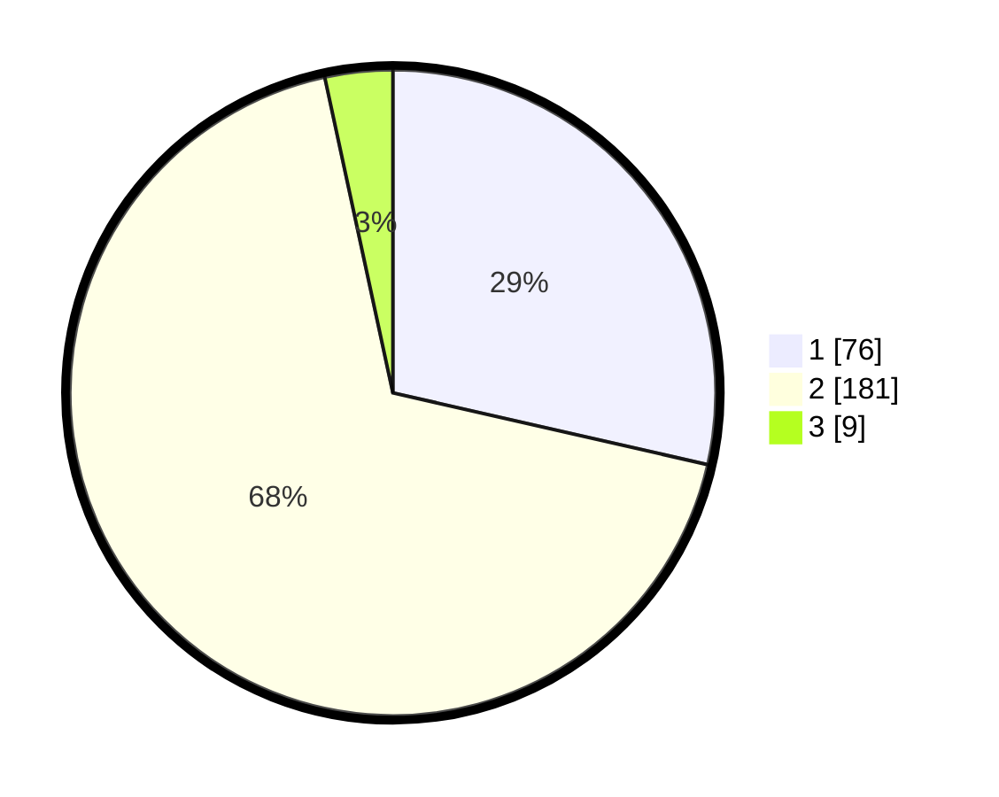

# Hasil

## Grafik

## Tabel

| No. | Nama Paslon    | Suara | Suara (raw) | Persentase |
|:--- |:-------------- | -----:| -----------:| ----------:|
| 1   | ANIES MUHAIMIN | 76    | [76][p-1]   | 28,57      |
| 2   | PRABOWO GIBRAN | 181   | [181][p-2]  | 68,05      |
| 3   | GANJAR MAHFUD  | 9     | [9][p-3]    | 3,38       |

[p-1]: https://github.com/gigit-pemilu/pemilu-2024-75-gorontalo/blob/main/pilpres/hitung-suara/sub/75-gorontalo/sub/71-kota-gorontalo/sub/04-dungingi/sub/1002-libuo/sub/011-tps/sub/paslon-1.txt
[p-2]: https://github.com/gigit-pemilu/pemilu-2024-75-gorontalo/blob/main/pilpres/hitung-suara/sub/75-gorontalo/sub/71-kota-gorontalo/sub/04-dungingi/sub/1002-libuo/sub/011-tps/sub/paslon-2.txt
[p-3]: https://github.com/gigit-pemilu/pemilu-2024-75-gorontalo/blob/main/pilpres/hitung-suara/sub/75-gorontalo/sub/71-kota-gorontalo/sub/04-dungingi/sub/1002-libuo/sub/011-tps/sub/paslon-3.txt

## Foto C Plano

https://sirekap-obj-formc.kpu.go.id/1dc7/pemilu/ppwp/75/71/04/10/02/7571041002011-20240225-201327--b501004f-6bf8-4659-8c17-d694b11bc1a9.jpg

https://sirekap-obj-formc.kpu.go.id/1dc7/pemilu/ppwp/75/71/04/10/02/7571041002011-20240225-201404--76d34fc2-d9a3-46e2-85ca-423d388f68a0.jpg

https://sirekap-obj-formc.kpu.go.id/1dc7/pemilu/ppwp/75/71/04/10/02/7571041002011-20240225-201442--1bcf5be8-ac37-47c2-804a-ab5abdc7dff2.jpg

## Metadata

| Key        | Value               |
| ---------- | ------------------- |
| Time Stamp | 2024-02-26 11:00:00 |

