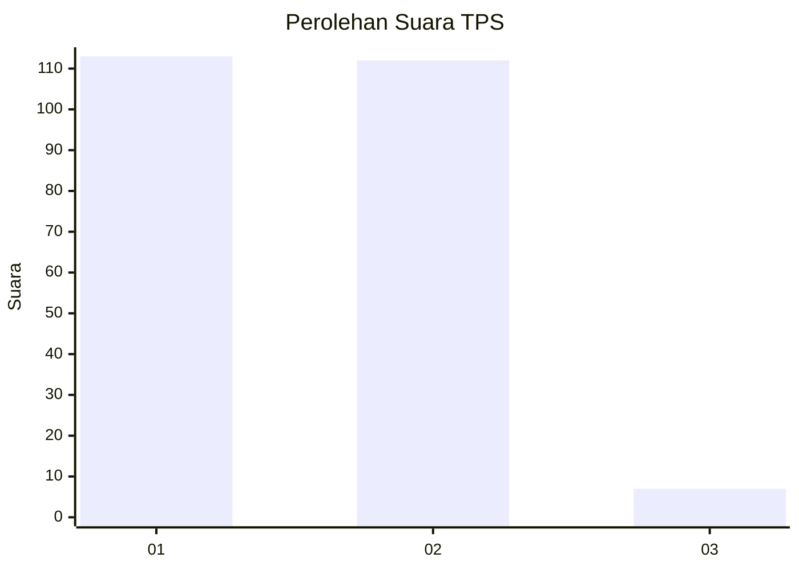
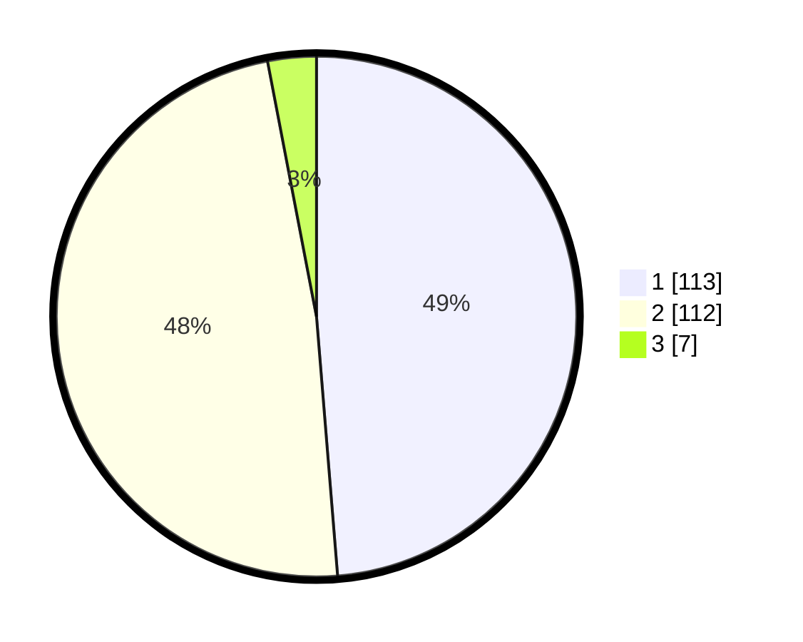

# Hasil

## Grafik

## Tabel

| No. | Nama Paslon    | Suara | Suara (raw) | Persentase |
|:--- |:-------------- | -----:| -----------:| ----------:|
| 1   | ANIES MUHAIMIN | 113   | [113][p-1]  | 48,71      |
| 2   | PRABOWO GIBRAN | 112   | [112][p-2]  | 48,28      |
| 3   | GANJAR MAHFUD  | 7     | [7][p-3]    | 3,02       |

[p-1]: https://github.com/gigit-pemilu/pemilu-2024-75-gorontalo/blob/main/pilpres/hitung-suara/sub/75-gorontalo/sub/71-kota-gorontalo/sub/06-kota-tengah/sub/1001-wumialo/sub/009-tps/sub/paslon-1.txt
[p-2]: https://github.com/gigit-pemilu/pemilu-2024-75-gorontalo/blob/main/pilpres/hitung-suara/sub/75-gorontalo/sub/71-kota-gorontalo/sub/06-kota-tengah/sub/1001-wumialo/sub/009-tps/sub/paslon-2.txt
[p-3]: https://github.com/gigit-pemilu/pemilu-2024-75-gorontalo/blob/main/pilpres/hitung-suara/sub/75-gorontalo/sub/71-kota-gorontalo/sub/06-kota-tengah/sub/1001-wumialo/sub/009-tps/sub/paslon-3.txt

## Foto C Plano

https://sirekap-obj-formc.kpu.go.id/ba36/pemilu/ppwp/75/71/06/10/01/7571061001009-20240215-124321--2cbea77e-a256-4fc6-b6a6-161dd054d875.jpg

https://sirekap-obj-formc.kpu.go.id/ba36/pemilu/ppwp/75/71/06/10/01/7571061001009-20240215-125351--ff2e3ad7-21f3-40bc-ae95-c8070825aae2.jpg

https://sirekap-obj-formc.kpu.go.id/ba36/pemilu/ppwp/75/71/06/10/01/7571061001009-20240215-125630--c8e58c6c-c0f3-4bad-960f-8f55b4880235.jpg

## Metadata

| Key        | Value               |
| ---------- | ------------------- |
| Time Stamp | 2024-02-16 01:30:27 |

