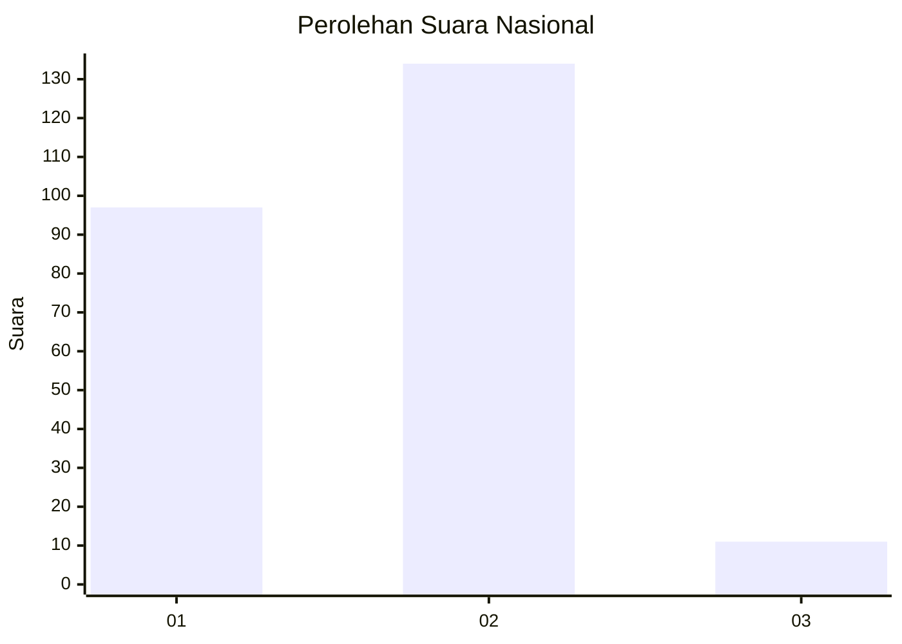
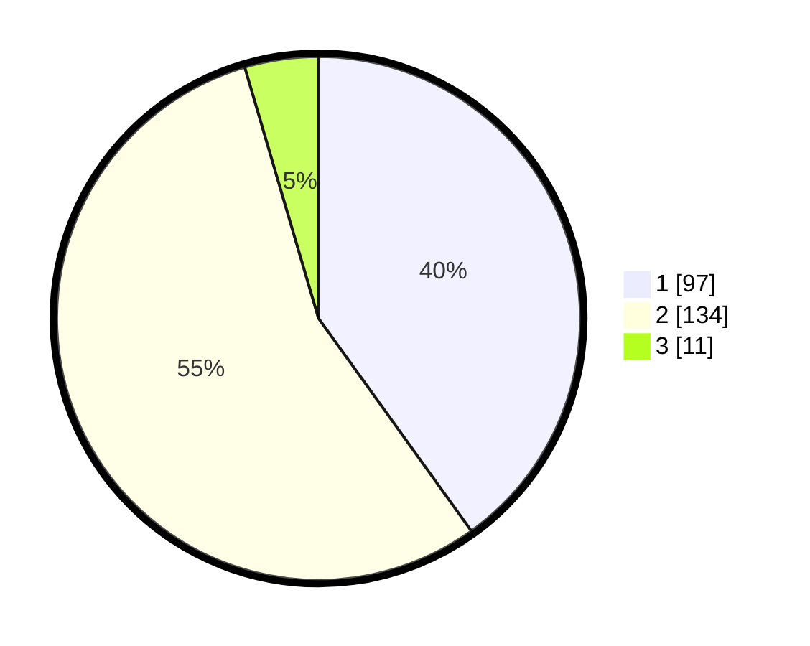

# Hasil

## Grafik

## Tabel

| No. | Nama Paslon    | Suara | Suara (raw) | Persentase |
|:--- |:-------------- | -----:| -----------:| ----------:|
| 1   | ANIES MUHAIMIN | 97    | [97][p-1]   | 40,08      |
| 2   | PRABOWO GIBRAN | 134   | [134][p-2]  | 55,37      |
| 3   | GANJAR MAHFUD  | 11    | [11][p-3]   | 4,55       |

[p-1]: https://github.com/gigit-pemilu/pemilu-2024/blob/main/pilpres/hitung-suara/sub/75-gorontalo/sub/71-kota-gorontalo/sub/06-kota-tengah/sub/1001-wumialo/sub/011-tps/sub/paslon-1.txt
[p-2]: https://github.com/gigit-pemilu/pemilu-2024/blob/main/pilpres/hitung-suara/sub/75-gorontalo/sub/71-kota-gorontalo/sub/06-kota-tengah/sub/1001-wumialo/sub/011-tps/sub/paslon-2.txt
[p-3]: https://github.com/gigit-pemilu/pemilu-2024/blob/main/pilpres/hitung-suara/sub/75-gorontalo/sub/71-kota-gorontalo/sub/06-kota-tengah/sub/1001-wumialo/sub/011-tps/sub/paslon-3.txt

## Foto C Plano

https://sirekap-obj-formc.kpu.go.id/31d6/pemilu/ppwp/75/71/06/10/01/7571061001011-20240215-000326--3fa05144-a410-4c7d-97e9-ec9bbbf144f8.jpg

https://sirekap-obj-formc.kpu.go.id/31d6/pemilu/ppwp/75/71/06/10/01/7571061001011-20240215-000859--a6af3875-8507-400e-8b74-e471368880a1.jpg

https://sirekap-obj-formc.kpu.go.id/31d6/pemilu/ppwp/75/71/06/10/01/7571061001011-20240215-001226--607a275d-11fe-461c-8f96-b82af29fb316.jpg

## Metadata

| Key        | Value               |
| ---------- | ------------------- |
| Time Stamp | 2024-02-16 02:00:27 |

