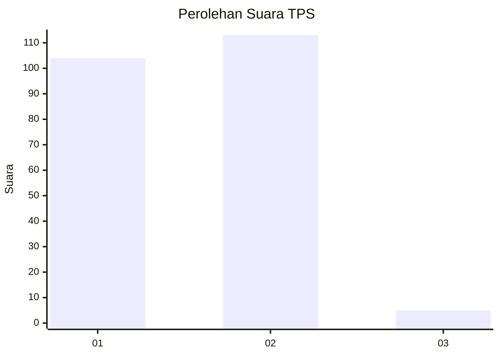
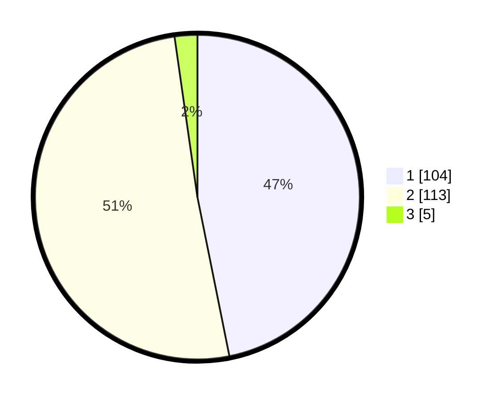

# Hasil

## Grafik

## Tabel

| No. | Nama Paslon    | Suara | Suara (raw) | Persentase |
|:--- |:-------------- | -----:| -----------:| ----------:|
| 1   | ANIES MUHAIMIN | 104   | [104][p-1]  | 46,85      |
| 2   | PRABOWO GIBRAN | 113   | [113][p-2]  | 50,90      |
| 3   | GANJAR MAHFUD  | 5     | [5][p-3]    | 2,25       |

[p-1]: https://github.com/gigit-pemilu/pemilu-2024-75-gorontalo/blob/main/pilpres/hitung-suara/sub/75-gorontalo/sub/71-kota-gorontalo/sub/06-kota-tengah/sub/1001-wumialo/sub/012-tps/sub/paslon-1.txt
[p-2]: https://github.com/gigit-pemilu/pemilu-2024-75-gorontalo/blob/main/pilpres/hitung-suara/sub/75-gorontalo/sub/71-kota-gorontalo/sub/06-kota-tengah/sub/1001-wumialo/sub/012-tps/sub/paslon-2.txt
[p-3]: https://github.com/gigit-pemilu/pemilu-2024-75-gorontalo/blob/main/pilpres/hitung-suara/sub/75-gorontalo/sub/71-kota-gorontalo/sub/06-kota-tengah/sub/1001-wumialo/sub/012-tps/sub/paslon-3.txt

## Foto C Plano

https://sirekap-obj-formc.kpu.go.id/7ef2/pemilu/ppwp/75/71/06/10/01/7571061001012-20240215-023221--589e0b11-65c9-46c1-9329-c3a273af8b57.jpg

https://sirekap-obj-formc.kpu.go.id/7ef2/pemilu/ppwp/75/71/06/10/01/7571061001012-20240215-023444--c8ae663d-2667-4537-a533-c8d4ed350f61.jpg

https://sirekap-obj-formc.kpu.go.id/7ef2/pemilu/ppwp/75/71/06/10/01/7571061001012-20240215-023603--10f8881d-0a32-4e58-856f-02745143df89.jpg

## Metadata

| Key        | Value               |
| ---------- | ------------------- |
| Time Stamp | 2024-02-16 02:00:27 |

