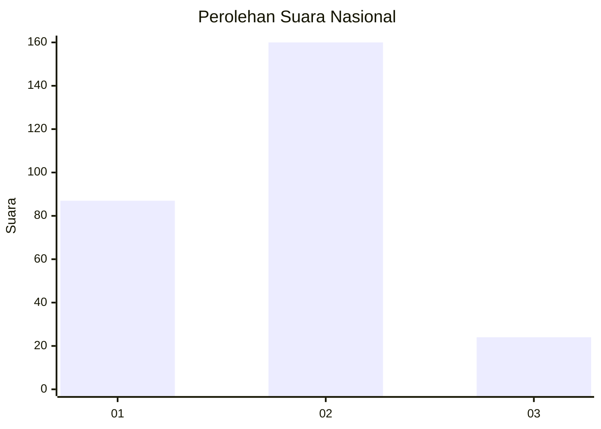
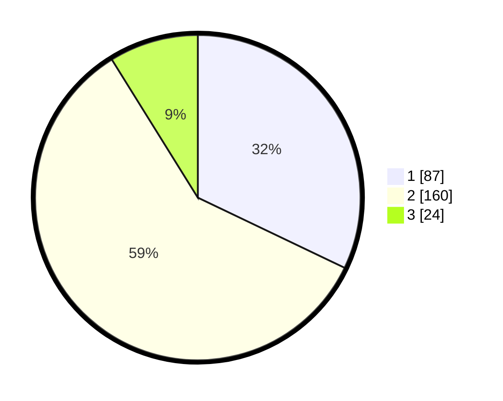

# Hasil

## Grafik

## Tabel

| No. | Nama Paslon    | Suara | Suara (raw) | Persentase |
|:--- |:-------------- | -----:| -----------:| ----------:|
| 1   | ANIES MUHAIMIN | 87    | [87][p-1]   | 32,10      |
| 2   | PRABOWO GIBRAN | 160   | [160][p-2]  | 59,04      |
| 3   | GANJAR MAHFUD  | 24    | [24][p-3]   | 8,86       |

[p-1]: https://github.com/gigit-pemilu/pemilu-2024/blob/main/pilpres/hitung-suara/sub/75-gorontalo/sub/71-kota-gorontalo/sub/06-kota-tengah/sub/1003-liluwo/sub/005-tps/sub/paslon-1.txt
[p-2]: https://github.com/gigit-pemilu/pemilu-2024/blob/main/pilpres/hitung-suara/sub/75-gorontalo/sub/71-kota-gorontalo/sub/06-kota-tengah/sub/1003-liluwo/sub/005-tps/sub/paslon-2.txt
[p-3]: https://github.com/gigit-pemilu/pemilu-2024/blob/main/pilpres/hitung-suara/sub/75-gorontalo/sub/71-kota-gorontalo/sub/06-kota-tengah/sub/1003-liluwo/sub/005-tps/sub/paslon-3.txt

## Foto C Plano

https://sirekap-obj-formc.kpu.go.id/4459/pemilu/ppwp/75/71/06/10/03/7571061003005-20240226-100437--69d810e4-2fda-4312-a873-c28fc4504384.jpg

https://sirekap-obj-formc.kpu.go.id/4459/pemilu/ppwp/75/71/06/10/03/7571061003005-20240215-101430--fa5d2f7c-d4f3-4b40-b19a-af4c15404125.jpg

https://sirekap-obj-formc.kpu.go.id/4459/pemilu/ppwp/75/71/06/10/03/7571061003005-20240215-101907--1b70e40b-7c5f-4a3c-9333-e0e46290acd8.jpg

## Metadata

| Key        | Value               |
| ---------- | ------------------- |
| Time Stamp | 2024-02-26 11:00:00 |

