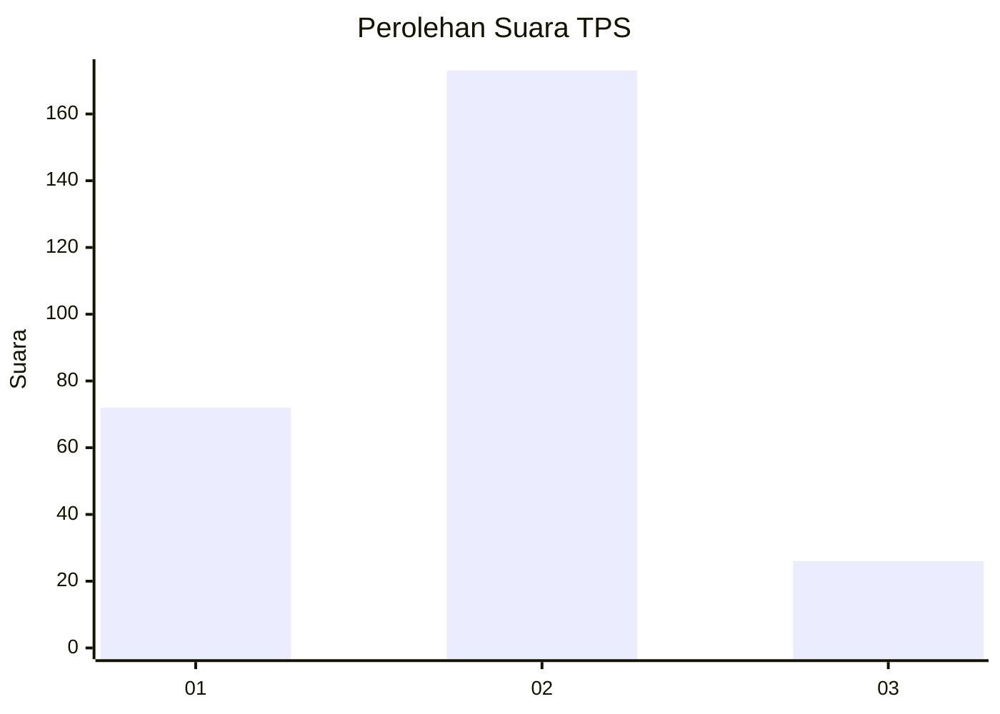
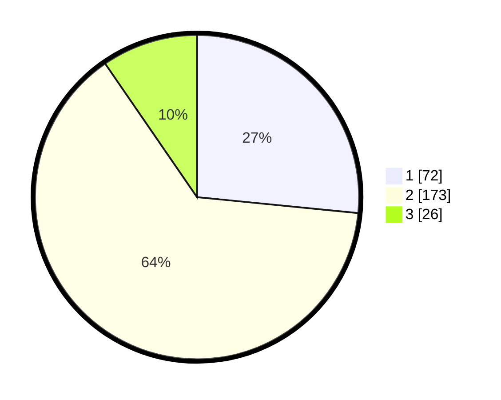

# Hasil

## Grafik

## Tabel

| No. | Nama Paslon    | Suara | Suara (raw) | Persentase |
|:--- |:-------------- | -----:| -----------:| ----------:|
| 1   | ANIES MUHAIMIN | 72    | [72][p-1]   | 26,57      |
| 2   | PRABOWO GIBRAN | 173   | [173][p-2]  | 63,84      |
| 3   | GANJAR MAHFUD  | 26    | [26][p-3]   | 9,59       |

[p-1]: https://github.com/gigit-pemilu/pemilu-2024-75-gorontalo/blob/main/pilpres/hitung-suara/sub/75-gorontalo/sub/71-kota-gorontalo/sub/06-kota-tengah/sub/1003-liluwo/sub/006-tps/sub/paslon-1.txt
[p-2]: https://github.com/gigit-pemilu/pemilu-2024-75-gorontalo/blob/main/pilpres/hitung-suara/sub/75-gorontalo/sub/71-kota-gorontalo/sub/06-kota-tengah/sub/1003-liluwo/sub/006-tps/sub/paslon-2.txt
[p-3]: https://github.com/gigit-pemilu/pemilu-2024-75-gorontalo/blob/main/pilpres/hitung-suara/sub/75-gorontalo/sub/71-kota-gorontalo/sub/06-kota-tengah/sub/1003-liluwo/sub/006-tps/sub/paslon-3.txt

## Foto C Plano

https://sirekap-obj-formc.kpu.go.id/164a/pemilu/ppwp/75/71/06/10/03/7571061003006-20240226-110617--8c6cce66-07cd-4968-adc2-86620b4417a0.jpg

https://sirekap-obj-formc.kpu.go.id/164a/pemilu/ppwp/75/71/06/10/03/7571061003006-20240226-110639--695bea4a-ff89-495d-9673-5714d429f4c7.jpg

https://sirekap-obj-formc.kpu.go.id/164a/pemilu/ppwp/75/71/06/10/03/7571061003006-20240226-110652--db49642f-2816-4410-8c24-4b8b36f119e9.jpg

## Metadata

| Key        | Value               |
| ---------- | ------------------- |
| Time Stamp | 2024-02-26 21:00:00 |

