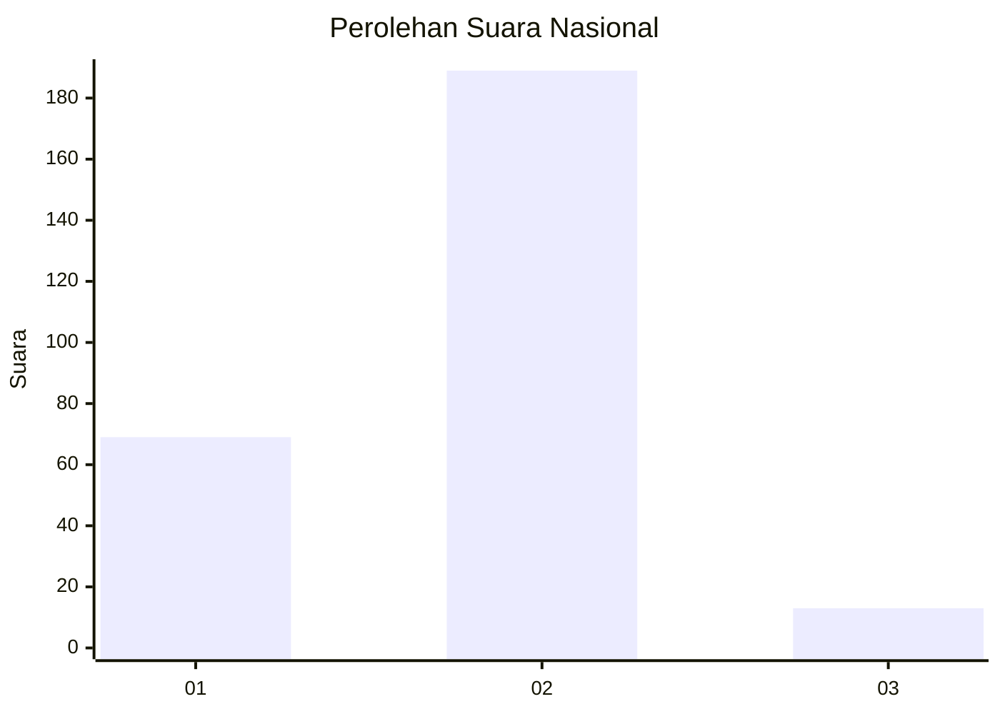
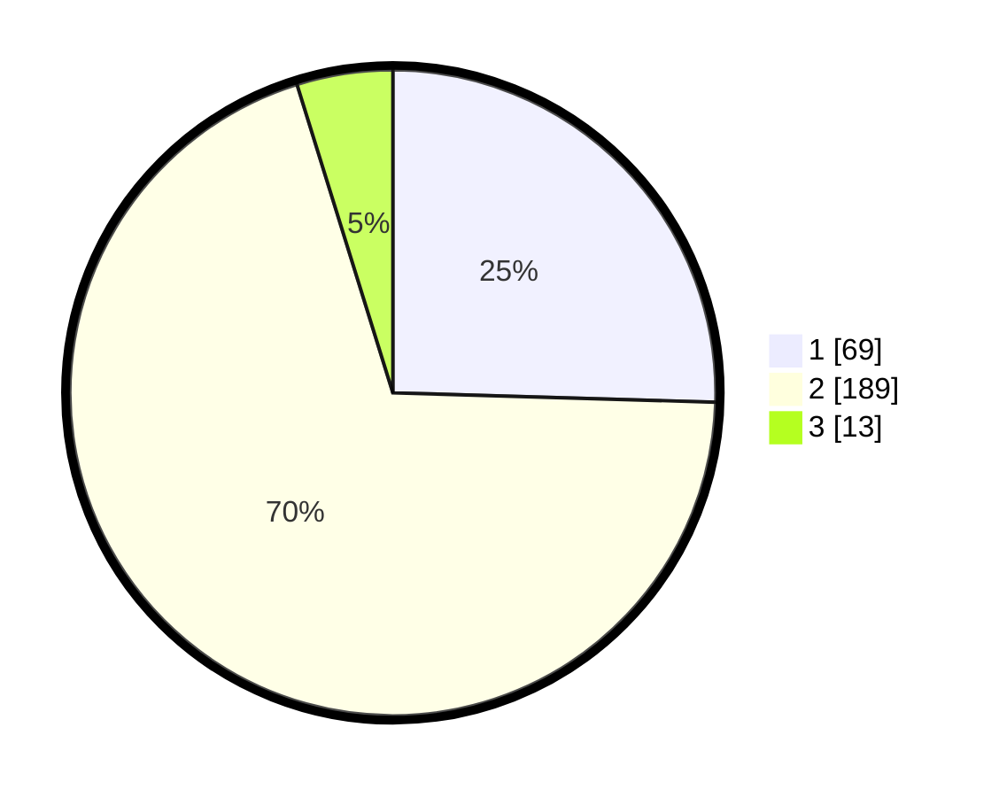

# Hasil

## Grafik

## Tabel

| No. | Nama Paslon    | Suara | Suara (raw) | Persentase |
|:--- |:-------------- | -----:| -----------:| ----------:|
| 1   | ANIES MUHAIMIN | 69    | [69][p-1]   | 25,46      |
| 2   | PRABOWO GIBRAN | 189   | [189][p-2]  | 69,74      |
| 3   | GANJAR MAHFUD  | 13    | [13][p-3]   | 4,80       |

[p-1]: https://github.com/gigit-pemilu/pemilu-2024/blob/main/pilpres/hitung-suara/sub/75-gorontalo/sub/71-kota-gorontalo/sub/08-dumbo-raya/sub/1003-talumolo/sub/010-tps/sub/paslon-1.txt
[p-2]: https://github.com/gigit-pemilu/pemilu-2024/blob/main/pilpres/hitung-suara/sub/75-gorontalo/sub/71-kota-gorontalo/sub/08-dumbo-raya/sub/1003-talumolo/sub/010-tps/sub/paslon-2.txt
[p-3]: https://github.com/gigit-pemilu/pemilu-2024/blob/main/pilpres/hitung-suara/sub/75-gorontalo/sub/71-kota-gorontalo/sub/08-dumbo-raya/sub/1003-talumolo/sub/010-tps/sub/paslon-3.txt

## Foto C Plano

https://sirekap-obj-formc.kpu.go.id/5050/pemilu/ppwp/75/71/08/10/03/7571081003010-20240214-233952--aa6960f2-df46-4999-9e03-b736b051df36.jpg

https://sirekap-obj-formc.kpu.go.id/5050/pemilu/ppwp/75/71/08/10/03/7571081003010-20240214-234250--782225cb-a9b7-4374-b01f-a8adac20ed5e.jpg

https://sirekap-obj-formc.kpu.go.id/5050/pemilu/ppwp/75/71/08/10/03/7571081003010-20240215-213443--4131df98-6426-42c1-9744-d95a0eff45a3.jpg

## Metadata

| Key        | Value               |
| ---------- | ------------------- |
| Time Stamp | 2024-02-15 23:29:50 |

