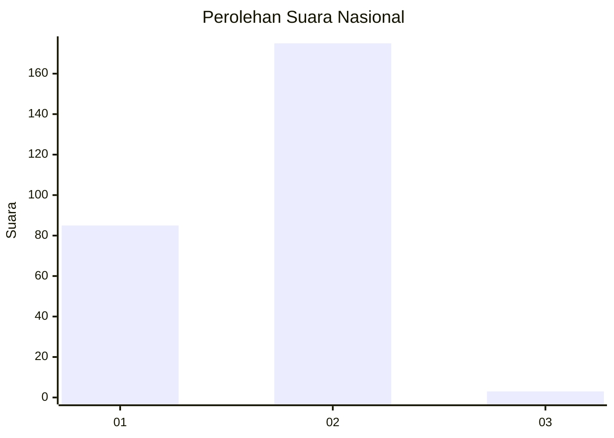
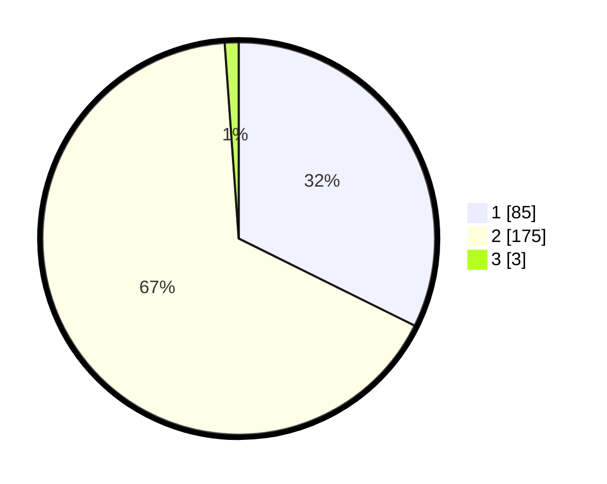

# Hasil

## Grafik

## Tabel

| No. | Nama Paslon    | Suara | Suara (raw) | Persentase |
|:--- |:-------------- | -----:| -----------:| ----------:|
| 1   | ANIES MUHAIMIN | 85    | [85][p-1]   | 32,32      |
| 2   | PRABOWO GIBRAN | 175   | [175][p-2]  | 66,54      |
| 3   | GANJAR MAHFUD  | 3     | [3][p-3]    | 1,14       |

[p-1]: https://github.com/gigit-pemilu/pemilu-2024/blob/main/pilpres/hitung-suara/sub/75-gorontalo/sub/71-kota-gorontalo/sub/08-dumbo-raya/sub/1003-talumolo/sub/013-tps/sub/paslon-1.txt
[p-2]: https://github.com/gigit-pemilu/pemilu-2024/blob/main/pilpres/hitung-suara/sub/75-gorontalo/sub/71-kota-gorontalo/sub/08-dumbo-raya/sub/1003-talumolo/sub/013-tps/sub/paslon-2.txt
[p-3]: https://github.com/gigit-pemilu/pemilu-2024/blob/main/pilpres/hitung-suara/sub/75-gorontalo/sub/71-kota-gorontalo/sub/08-dumbo-raya/sub/1003-talumolo/sub/013-tps/sub/paslon-3.txt

## Foto C Plano

https://sirekap-obj-formc.kpu.go.id/7fdd/pemilu/ppwp/75/71/08/10/03/7571081003013-20240215-053935--a7dff869-7618-442a-9d34-83f9f5fe3ff8.jpg

https://sirekap-obj-formc.kpu.go.id/7fdd/pemilu/ppwp/75/71/08/10/03/7571081003013-20240215-054159--27203bac-3892-4f87-9964-2b515f4f2abe.jpg

https://sirekap-obj-formc.kpu.go.id/7fdd/pemilu/ppwp/75/71/08/10/03/7571081003013-20240215-054731--b0e5a4da-17ba-4781-9853-457f8ef4063e.jpg

## Metadata

| Key        | Value               |
| ---------- | ------------------- |
| Time Stamp | 2024-02-15 19:00:26 |

