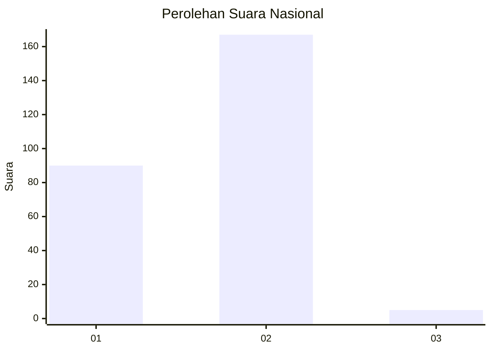
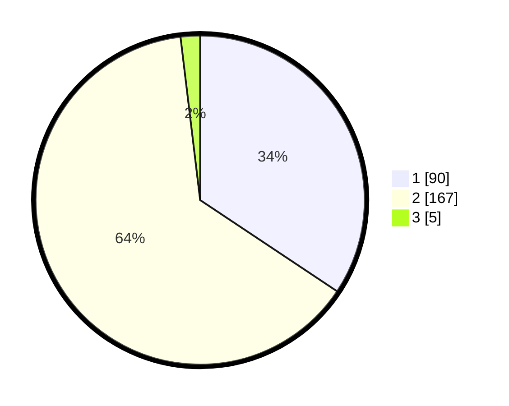

# Hasil

## Grafik

## Tabel

| No. | Nama Paslon    | Suara | Suara (raw) | Persentase |
|:--- |:-------------- | -----:| -----------:| ----------:|
| 1   | ANIES MUHAIMIN | 90    | [90][p-1]   | 34,35      |
| 2   | PRABOWO GIBRAN | 167   | [167][p-2]  | 63,74      |
| 3   | GANJAR MAHFUD  | 5     | [5][p-3]    | 1,91       |

[p-1]: https://github.com/gigit-pemilu/pemilu-2024/blob/main/pilpres/hitung-suara/sub/75-gorontalo/sub/71-kota-gorontalo/sub/08-dumbo-raya/sub/1005-bugis/sub/009-tps/sub/paslon-1.txt
[p-2]: https://github.com/gigit-pemilu/pemilu-2024/blob/main/pilpres/hitung-suara/sub/75-gorontalo/sub/71-kota-gorontalo/sub/08-dumbo-raya/sub/1005-bugis/sub/009-tps/sub/paslon-2.txt
[p-3]: https://github.com/gigit-pemilu/pemilu-2024/blob/main/pilpres/hitung-suara/sub/75-gorontalo/sub/71-kota-gorontalo/sub/08-dumbo-raya/sub/1005-bugis/sub/009-tps/sub/paslon-3.txt

## Foto C Plano

https://sirekap-obj-formc.kpu.go.id/2782/pemilu/ppwp/75/71/08/10/05/7571081005009-20240215-030718--d54f8ee9-25ee-4e51-bd67-f676e65a34ca.jpg

https://sirekap-obj-formc.kpu.go.id/2782/pemilu/ppwp/75/71/08/10/05/7571081005009-20240215-030912--6e0d9a2e-a03c-4ea8-aab7-88461d78b309.jpg

https://sirekap-obj-formc.kpu.go.id/2782/pemilu/ppwp/75/71/08/10/05/7571081005009-20240215-031120--fa6c2c39-4e08-4c71-957d-9e9884350564.jpg

## Metadata

| Key        | Value               |
| ---------- | ------------------- |
| Time Stamp | 2024-02-15 21:01:18 |

